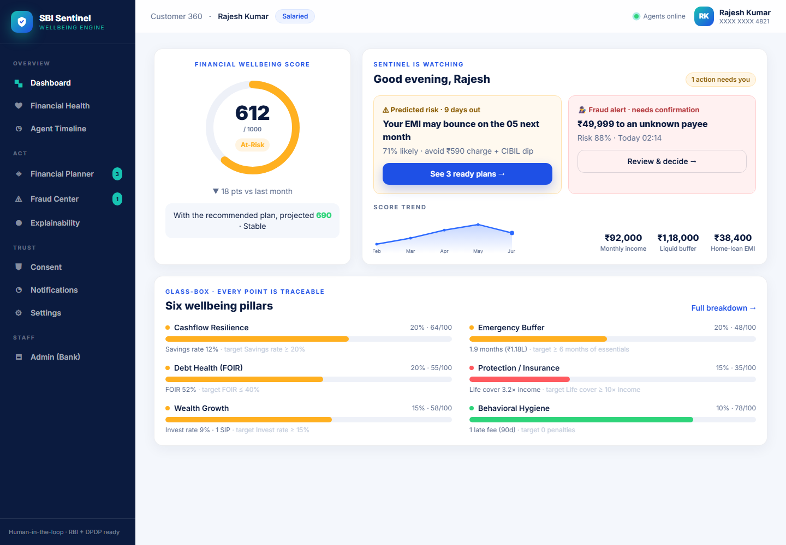
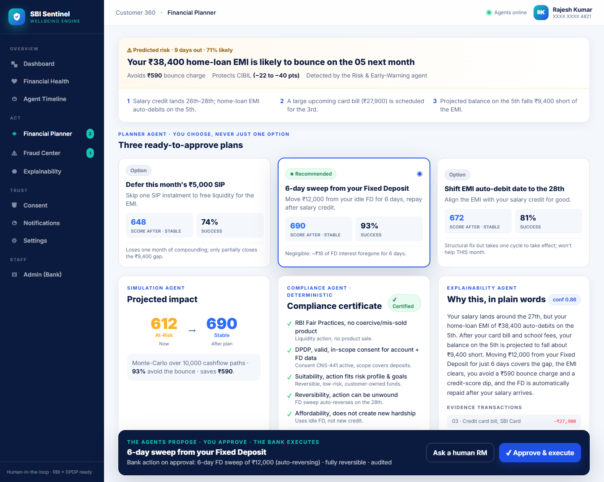

<div align="center">

# 🛡️ SBI Sentinel
### Autonomous Financial Wellbeing Engine

**An always-on team of AI agents that watches each customer's financial life, catches trouble _before_ it happens, and hands them a ready-to-approve plan.**

`The agents propose · the customer approves · the bank executes.`

*SBI Hackathon @ Global Fintech Fest 2026 · Theme: Agentic AI & Emerging Tech · Problem: Digital Engagement*

</div>

---

## The one thing that makes this deployable inside SBI

Every other "AI banking" idea stumbles on the same wall: **a regulated bank cannot let an AI move money on its own.** Sentinel is built human-in-the-loop from the ground up, > **Detect → Plan → Simulate → Compliance-check → Explain → Propose → _(customer approves)_ → Bank executes → Audit**

A **deterministic compliance engine** (not the LLM) certifies or **vetoes** every plan against RBI + DPDP rules. Every recommendation carries its **confidence, evidence transactions, compliance certificate, and a reversible action**: written to an immutable audit ledger. That is the moat: any LLM can _suggest_; Sentinel _proves it's safe_ and shows its work.

## The Financial Wellbeing Score (glass-box)

A single number `0-1000` from six pillars, **every point traceable to a transaction**, so it survives an RBI explainability review.

| Cashflow 20% · Emergency Buffer 20% · Debt Health 20% · Protection 15% · Wealth Growth 15% · Behavioral Hygiene 10% |
|---|
| Bands: **0-400 Critical · 401-600 At-Risk · 601-800 Stable · 801-1000 Thriving** |

## The 8 agents

`Orchestrator` · `Financial Health` · `Risk & Early-Warning` · `Fraud & Anomaly` · `Planner` · `Simulation` · `Compliance & Guardrail` · `Explainability`: orchestrated with **LangGraph**, given governed tools via **MCP**, reasoning on **a frontier-class LLM**.

## Why SBI funds it

| Capability | SBI metric moved |
|---|---|
| Risk & Early-Warning | Lower NPA, lower collection cost |
| Fraud & Anomaly | Fraud loss avoided |
| Health + Planner | CASA retention, YONO engagement |
| Gap analysis (consented) | Ethical, suitability-checked cross-sell |
| Compliance + Explainability | Deployability & regulatory trust |

## Tech stack

**Frontend** React 18 · TypeScript · Vite · Tailwind · Recharts &nbsp;|&nbsp; **Backend** Python 3.12 · FastAPI · Kafka · Temporal · Redis &nbsp;|&nbsp; **AI** LangGraph · MCP · a frontier-class LLM · deterministic compliance engine (OPA/Rego) &nbsp;|&nbsp; **Data** PostgreSQL · Neo4j · pgvector/Qdrant · hybrid RAG &nbsp;|&nbsp; **Platform** Kubernetes · sovereign-cloud VPC · India data-localized · OTel/Prometheus/Grafana/Langfuse

## Preview

| Dashboard | Financial Planner (the golden path) |
|---|---|
|  |  |

## 📂 What's in this repo

| Deliverable | Location |
|---|---|
| Master concept (source of truth) | [`docs/00-MASTER-CONCEPT.md`](docs/00-MASTER-CONCEPT.md) |
| Product Requirements Document | [`docs/01-prd/`](docs/01-prd/PRD.md) |
| Technical Architecture (Mermaid) | [`docs/02-architecture/`](docs/02-architecture/ARCHITECTURE.md) |
| AI Agent Design (prompts, evals) | [`docs/03-ai-agents/`](docs/03-ai-agents/AI-AGENT-DESIGN.md) |
| Financial Wellbeing Engine (math) | [`docs/04-financial-engine/`](docs/04-financial-engine/FINANCIAL-WELLBEING-ENGINE.md) |
| Architecture Decision Records | [`docs/05-adr/`](docs/05-adr/ARCHITECTURE-DECISIONS.md) |
| Tech Stack | [`docs/06-tech-stack/`](docs/06-tech-stack/TECH-STACK.md) |
| Database Design (ER + graph + DDL) | [`docs/07-database/`](docs/07-database/DATABASE-DESIGN.md) |
| API Spec + OpenAPI | [`docs/08-api/`](docs/08-api/API-SPECIFICATION.md) |
| UI Spec | [`docs/09-ui/`](docs/09-ui/) |
| Pitch Deck (PDF) | [`docs/10-deck/SBI-Sentinel-Deck.pdf`](docs/10-deck/SBI-Sentinel-Deck.pdf) |
| Portal-ready submission | [`docs/11-submission/`](docs/11-submission/PORTAL-READY-SUBMISSION.md) |
| 3-minute Demo Script | [`docs/12-demo/`](docs/12-demo/DEMO-SCRIPT.md) |
| Build Plan | [`docs/13-build-plan/`](docs/13-build-plan/BUILD-PLAN.md) |
| Repo Structure | [`docs/14-REPO-STRUCTURE.md`](docs/14-REPO-STRUCTURE.md) |
| **Live React prototype** | [`apps/web/`](apps/web/) |

## ▶️ Run the prototype

```bash
cd apps/web
npm install
npm run dev # open http://localhost:5173
```

The prototype runs **fully offline** on a synthetic customer (Rajesh Kumar) so the live demo never depends on a network. It walks the entire golden path: At-Risk score → predicted EMI bounce → 3 plans → simulation → compliance certificate → plain-language explanation → **Approve** → executed + audited, plus a fraud-alert cameo.

---

<div align="center">
<sub>Human-in-the-loop · glass-box · RBI + DPDP ready · built to deploy inside SBI</sub>
</div>
