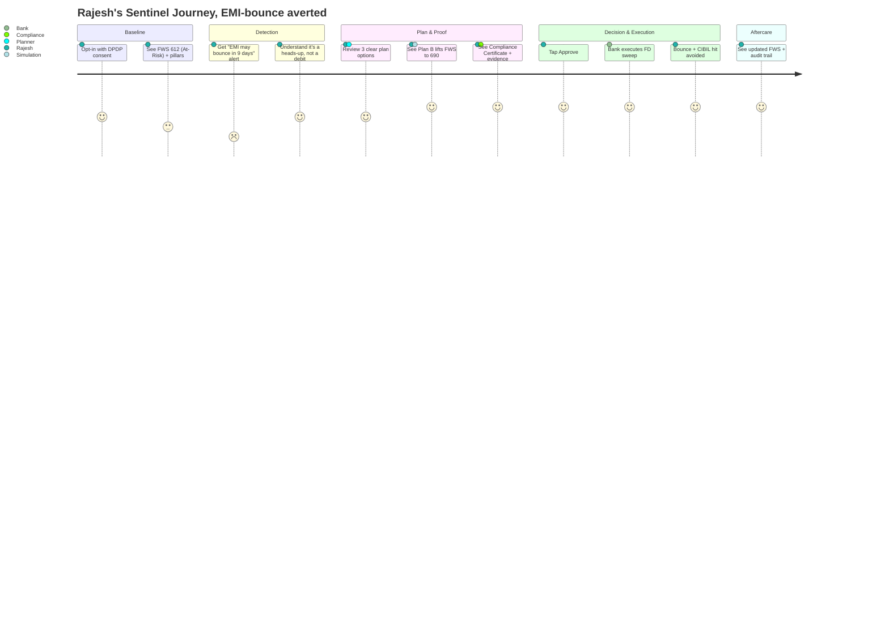
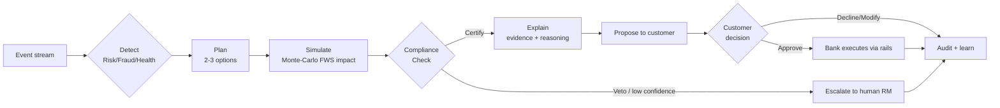

# SBI Sentinel, Product Requirements Document (PRD)

**Product:** SBI Sentinel, Autonomous Financial Wellbeing Engine
**Theme:** Agentic AI & Emerging Tech · **Problem Statement:** Digital Engagement
**Event:** SBI Hackathon @ Global Fintech Fest (GFF) 2026
**Document owner:** Principal Product Manager, SBI Innovation Team
**Version:** 1.0 · **Status:** For review · **Date:** 04 Jul 2026
**Source of truth:** `docs/00-MASTER-CONCEPT.md` (this PRD is subordinate to and consistent with it)

> **One-liner.** SBI Sentinel is an always-on team of AI agents that watches each customer's
> financial life, catches trouble *before* it happens, a bounced EMI, a shrinking emergency
> fund, a fraud pattern, an under-insured family, and hands the customer a ready-to-approve plan.
> **The agents propose; the customer approves; the bank executes.** The AI never moves money on its own.

---

## 1. Problem Statement

India's banking relationship is fundamentally **reactive**. A customer discovers a problem only
after it has already cost them: the EMI has already bounced (and the ₹500-₹600 penalty plus a CIBIL
ding has already landed), the emergency fund has already run dry, the fraudulent UPI mandate has
already debited, the family is discovered to be under-insured only at the hospital billing counter.
The bank's own systems know months in advance, the salary-credit rhythm, the FOIR creep, the
liquidity squeeze, but that intelligence is trapped in risk-and-collections back offices and never
reaches the customer in time to help them.

This reactivity is expensive on both sides of the ledger, and the macro numbers make it urgent:

- **NPA pressure.** Gross NPAs in the Indian banking system have fallen to multi-decade lows
 (~2.6-2.8% system-wide as of FY25), but the absolute stock is still measured in lakhs of crores,
 and retail slippage is the new frontier as unsecured lending has ballooned. Every retail account
 that slides from SMA-0 → SMA-1 → SMA-2 → NPA is a provisioning event and a collections cost. The
 RBI's own supervisory framework rewards **early recognition and early cure**. Today, the *customer*, the one person who can actually cure a pre-delinquency, is the last to know.
- **Fraud.** RBI's 2024-25 disclosures show bank fraud amounts more than **tripling year-on-year**,
 with digital/card-and-internet fraud dominating by volume. UPI scale (>18 billion monthly
 transactions) means fraud is now a real-time, pattern-based problem that human review cannot keep
 pace with.
- **Under-insurance & the protection gap.** India's protection gap remains among the widest in the
 world (~₹80-90 lakh-crore of un-insured mortality exposure by industry estimates); life insurance
 penetration sits around ~3% of GDP. A salaried customer with a home loan and two children is
 routinely covered at a fraction of the "10× annual income" rule of thumb, a single-earner
 catastrophe waiting to become an NPA.
- **DPDP Act 2023.** The Digital Personal Data Protection Act (with Rules operationalising through
 2025-26) makes **explicit, purpose-bound, revocable consent** a legal precondition for using
 personal financial data, and creates real liability for misuse. Any personalisation engine built
 after 2023 must be **consent-native**, not consent-retrofitted.
- **Scale.** SBI serves **50+ crore customers** across ~22,500 branches and the YONO super-app.
 At that scale, human relationship managers cannot proactively watch every customer's financial
 health, the ratio is impossible. Only an **agentic, glass-box, compliance-validated** system can
 extend "private-banker-grade" foresight to the mass market without breaching cost-to-serve or
 regulatory limits.

**The gap Sentinel fills:** the bank has the data and the prediction capability; the customer has the
consent and the decision authority; regulation demands explainability and human control. No product
today closes all three at once. Sentinel is the **compliance-validated, human-in-the-loop bridge**
between the bank's foresight and the customer's action.

---

## 2. Vision & Product Principles

**Vision.** Turn SBI from a *transaction utility* into a *financial guardian*, an institution that
protects each customer's financial wellbeing proactively, provably, and with the customer always in
control. Sentinel makes "the bank that watches out for me" a mass-market reality for 50 crore Indians.

**Product principles (non-negotiable):**

1. **Human-in-the-loop by law and by design.** Agents detect → predict → plan → simulate →
 compliance-check → explain → **propose**. Money moves only on explicit customer consent via
 existing SBI rails (YONO / core banking / UPI). The AI never moves money on its own. On veto or
 low confidence, escalate to a human RM, never auto-act.
2. **Glass-box, not black-box.** The Financial Wellbeing Score (FWS 0-1000) is six deterministic,
 explainable pillars; every point traces to a transaction. This satisfies RBI expectations on AI
 explainability and lets a customer *trust the number*.
3. **The moat is proof, not suggestion.** Any LLM can *suggest*. Sentinel *proves* each suggestion is
 RBI/DPDP-safe via a deterministic Compliance & Guardrail engine and ships an **Explainability Ledger**
 (evidence + reasoning trail + Compliance Certificate). That is what a regulated bank can actually deploy.
4. **DPDP-native and data-localized.** Consent-first, purpose-bound, revocable; on-prem / sovereign-cloud
 VPC; PII tokenized; no PII in logs, prompts, or model training. Designed to pass an SBI risk review,
 not just wow a stage.
5. **Every agent tied to a P&L / risk metric.** Ethical business value, never charity, lower NPA,
 fraud loss avoided, suitability-checked cross-sell, cost-to-serve down, YONO stickiness up.
6. **Options, not orders.** The Planner returns 2-3 plans per issue. Sentinel advises and empowers;
 it never nudges the customer into a single bank-favourable path. Suitability and anti-mis-selling
 checks are enforced by the Compliance Agent, not left to good intentions.

---

## 3. Objectives (OKR-style)

**Objective 1, Shift SBI from reactive to proactive financial care.**
- KR1: Detect ≥ 80% of imminent EMI-bounce / overdraft / liquidity-crunch events **≥ 7 days** before impact.
- KR2: Deliver every detection as a ready-to-approve, compliance-certified plan within **60 seconds** of detection.
- KR3: Achieve a customer **approve-rate ≥ 35%** on proposed interventions (a decision was actually made).

**Objective 2, Make financial wellbeing measurable, explainable, and improvable.**
- KR1: Compute a glass-box FWS for 100% of enrolled customers with **every pillar point traceable** to source transactions.
- KR2: Achieve a median **+45-point FWS uplift** for At-Risk-band customers within 6 months of enrolment.
- KR3: Keep FWS explanation comprehension ≥ **85%** (measured via in-app "Did this make sense?" and RM audits).

**Objective 3, Reduce credit and fraud losses through early action.**
- KR1: Reduce **retail EMI-bounce incidence by 20%** among enrolled, engaged cohorts vs. control.
- KR2: Cut **pre-delinquency (SMA) → NPA conversion by 15%** in enrolled cohorts.
- KR3: Reduce **customer-borne fraud loss by 25%** on enrolled accounts via real-time anomaly consent-freezes.

**Objective 4, Deepen digital engagement, deployably and defensibly.**
- KR1: Lift **YONO DAU/MAU stickiness by 10 percentage points** among enrolled customers.
- KR2: Achieve **≥ 12% consented, suitability-checked cross-sell conversion** on protection/investment gaps.
- KR3: Pass a simulated **SBI risk & compliance gate** with zero critical findings (audit-ready Explainability Ledger).

---

## 4. KPIs & Success Metrics

Targets below are for the enrolled, engaged cohort measured against a matched holdout control group.
All uplift metrics are reported as **treatment vs. control**, not absolute, to isolate Sentinel's effect.

| # | KPI | Definition / how measured | Target | Business line |
|---|---|---|---|---|
| 1 | **NPA early-warning lead time** | Median days between Sentinel risk alert and the would-be delinquency event | **≥ 7 days** (goal 9+) | Credit risk |
| 2 | **EMI-bounce avoided %** | (Predicted bounces that did not occur after an approved plan) ÷ predicted bounces, vs. control | **≥ 20%** reduction | Credit risk |
| 3 | **SMA→NPA conversion reduction** | Δ in SMA-2 accounts sliding to NPA, enrolled vs. control | **≥ 15%** | Credit risk / provisioning |
| 4 | **FWS uplift** | Median FWS-point gain for At-Risk-band customers, 6-month window | **+45 points** | Engagement / wellbeing |
| 5 | **YONO DAU stickiness** | DAU/MAU ratio delta, enrolled vs. control | **+10 pp** | Digital engagement |
| 6 | **Fraud loss avoided (₹)** | Sum of blocked/frozen fraudulent debits attributable to Sentinel anomaly alerts | **≥ 25%** of baseline fraud loss on cohort | Fraud / ops risk |
| 7 | **Fraud-reporting SLA** | % of confirmed fraud reported to RBI within mandated window, Sentinel-assisted | **≥ 99%** within SLA | Regulatory |
| 8 | **Cross-sell conversion (consented)** | Suitability-passed protection/investment offers accepted ÷ offers shown, with a valid DPDP consent artifact | **≥ 12%** | SBI Life / SBI MF |
| 9 | **Intervention approve-rate** | Customer-approved plans ÷ plans proposed | **≥ 35%** | Product health |
| 10 | **Compliance veto integrity** | % of executed plans carrying a valid Compliance Certificate | **100%** (hard gate) | Regulatory |
| 11 | **Cost-to-serve** | Servicing cost per enrolled customer vs. RM-led baseline | **−30%** | Operations |
| 12 | **Explanation comprehension** | "Did this make sense?" yes-rate + RM audit sample | **≥ 85%** | Trust / UX |
| 13 | **Time-to-plan** | Detection timestamp → certified plan presented | **< 60 s** (p95) | Technical SLA |
| 14 | **False-positive rate (risk alerts)** | Alerts that did not correspond to a real emerging risk | **< 15%** | Model quality |

**Guardrail metrics (must not regress):** complaint rate, DPDP consent-withdrawal rate,
mis-selling escalations (target **zero**), and RM override rate (a proxy for agent trust).

---

## 5. Target Users & Segments

Sentinel is designed for the **full SBI retail base of 50+ crore customers**, phased by segment where
the pain-to-value ratio is highest first.

| Segment | Approx. profile | Primary Sentinel value | Phase |
|---|---|---|---|
| **Mass retail / semi-urban** | Salary/pension/PMJDY accounts, thin buffers, high bounce sensitivity | Bounce & liquidity early-warning, emergency-buffer coaching, fraud shield | Phase 1 (highest volume of avoidable harm) |
| **Salaried (urban)** | Steady credit, home/auto EMIs, some SIPs, chronically under-insured | FOIR management, protection-gap closure, EMI-date optimisation | Phase 1 (flagship persona, Rajesh) |
| **Self-employed / MSME-linked** | Volatile inflows, GST/tax cycles, working-capital stress | Cashflow-resilience forecasting, tax-optimisation prompts, buffer planning | Phase 2 |
| **Affluent / mass-affluent** | Multi-product, wealth-growth focus, cross-holdings | Wealth-growth pillar optimisation, portfolio & insurance adequacy, concierge-grade foresight | Phase 3 |

**Non-users / out-of-scope (v1):**
- Pure corporate / large-institutional banking (Sentinel is retail-first).
- Customers who **decline DPDP consent**: they retain full banking access; Sentinel simply does not
 activate. No dark patterns, no degraded service for non-consent.
- Non-SBI account aggregation beyond what the customer explicitly links via the **Account Aggregator (AA)**
 framework (consented external data only, v2+).
- **Autonomous money movement, high-risk speculative advice, and credit underwriting decisions**: Sentinel
 advises and proposes; it does not underwrite, sanction, or execute without consent.
- Minors' independent accounts (guardian-mediated only).

---

## 6. Pain Points Mapped to Solution

| Customer / bank pain point | Today's reality | Sentinel response | FWS pillar / agent |
|---|---|---|---|
| EMI bounces without warning | Penalty + CIBIL hit discovered after the fact | Risk agent predicts bounce ≥7 days out; Planner offers FD-sweep / date-shift / partial-defer plans | Debt Health · Risk & Early-Warning |
| Emergency fund silently erodes | Customer unaware until a shock hits | Emergency-buffer pillar tracks months-of-cover; nudges before it drops below 6 months | Emergency Buffer · Financial Health |
| Fraud / scam mandates | Debit noticed after money is gone | Fraud agent flags anomaly in real time; freezes **on customer consent**; assists RBI reporting | Behavioral Hygiene · Fraud & Anomaly |
| Under-insurance | Discovered at a crisis | Protection pillar computes cover vs. 10× income; proposes suitability-checked SBI Life top-up | Protection · Planner + Insurance-Gap tool |
| No idle-money growth | Savings sit at 2.7% | Wealth-growth pillar flags low invest-rate; proposes consented SIP/MF, suitability-checked | Wealth Growth · Planner + Investment-Gap tool |
| "The bank never explains" | Opaque scores, jargon | Glass-box FWS + Explainability Ledger: plain-language why + evidence transactions | All · Explainability Agent |
| Data-privacy anxiety | "Who sees my data and why?" | DPDP consent artifact per data use; revocable; PII tokenized; on-prem VPC | Platform · Compliance & Guardrail |
| Bank: NPA & collections cost | Cure attempted post-delinquency | Pre-delinquency nudges cure issues before slippage; collections load ↓ | Risk & Early-Warning |
| Bank: mis-selling risk | Sales-led cross-sell liability | Deterministic suitability + anti-mis-selling veto before any offer is shown | Compliance & Guardrail |

---

## 7. Personas

### Persona 1, Rajesh Kumar (flagship / demo golden path)
- **Age / city:** 34 · Pune, Maharashtra
- **Situation:** SBI salary account (~₹95,000/mo net), home-loan EMI ₹38,000, two young children,
 one SIP of ₹5,000, term cover only ₹25 lakh (≈2.6× income, badly under-insured), ~₹1.4 lakh in a
 linked FD. FWS **612 (At-Risk)**.
- **Goals:** Never miss an EMI; protect his family; slowly build wealth without "figuring out finance."
- **Frustrations:** Salary and EMI dates don't align; no time to monitor money; distrusts "sales calls"
 dressed as advice.
- **How Sentinel helps:** Risk agent detects a **71% EMI-bounce probability, 9 days out** (salary
 pattern + a large upcoming debit). Planner offers 3 options; Simulation shows Plan B (FD sweep) lifts
 FWS 612 → 690 and avoids a ₹590 bounce charge + CIBIL hit. Compliance certifies it (no mis-sell,
 suitable). Rajesh taps **Approve**; the bank executes the sweep; an audit entry is written. Separately,
 Sentinel surfaces his protection gap with a suitability-checked SBI Life top-up option, his choice.

### Persona 2, Priya Sharma (mass retail, buffer-fragile)
- **Age / city:** 28 · Lucknow, Uttar Pradesh
- **Situation:** School-teacher salary account (~₹32,000/mo), no investments, ~₹18,000 liquid buffer
 (< 1 month essentials), frequent small overdrafts and late fees. FWS **388 (Critical)**.
- **Goals:** Stop living paycheck-to-paycheck; stop losing money to penalties; feel in control.
- **Frustrations:** Overdraft fees she doesn't understand; fear of "investment" jargon; scam SMS anxiety.
- **How Sentinel helps:** Behavioral-Hygiene pillar surfaces the penalty leakage in plain language;
 Emergency-Buffer coaching sets a micro-auto-save goal (opt-in). Fraud agent shields her from a UPI
 scam-mandate pattern, freezing on her consent. Her FWS climbs as penalties stop, visible, motivating.

### Persona 3, Imran Qureshi (self-employed, volatile cashflow)
- **Age / city:** 41 · Surat, Gujarat
- **Situation:** Textile trader, SBI current + savings, lumpy inflows tied to order cycles, GST outflows,
 ₹12 lakh working-capital OD, thin personal insurance. FWS **545 (At-Risk)**.
- **Goals:** Smooth out cashflow shocks; never breach the OD limit at the wrong time; plan for tax.
- **Frustrations:** Feast-or-famine income; surprise GST/tax dues; no clear picture of "am I okay?"
- **How Sentinel helps:** Cashflow-Resilience forecasting warns of a liquidity trough before a GST due
 date; Planner proposes staggering an outflow or a short sweep. Tax-Optimisation tool flags a
 deductible SIP window. Every proposal is optional and suitability-checked.

### Persona 4, Anjali Menon (affluent, wealth-growth focused)
- **Age / city:** 47 · Bengaluru, Karnataka
- **Situation:** Senior IT professional (~₹4.2 lakh/mo), multiple SBI + external holdings (via AA),
 adequate cover, ₹60 lakh investable, but idle cash drag and unbalanced allocation. FWS **792 (Stable)**.
- **Goals:** Optimise returns; ensure her family's protection stays adequate as income grows; efficiency.
- **Frustrations:** Idle savings earning nothing; fragmented view across institutions; generic robo-advice.
- **How Sentinel helps:** Wealth-Growth pillar flags cash drag and a rebalancing opportunity; Simulation
 projects FWS and corpus impact; Compliance ensures every suggestion is suitable and non-mis-sold. She
 gets private-banker-grade foresight inside YONO, and always the final say.

---

## 8. End-to-End Customer Journey

### 8.1 Stage-by-stage

| Stage | Customer experience | What Sentinel does behind the glass | Consent / control gate |
|---|---|---|---|
| **0. Onboarding** | Opt-in inside YONO; sees what data, why, for how long | Records granular, purpose-bound DPDP consent artifact | Explicit opt-in; revocable anytime |
| **1. Baseline** | Sees FWS + 6-pillar breakdown, plain-language | Financial Health agent computes glass-box FWS from tokenized transactions | Read-only; no action taken |
| **2. Continuous watch** | Nothing intrusive; passive monitoring | Risk / Fraud / Health agents watch event streams | Consent-scoped data only |
| **3. Detection** | Timely alert: "Heads-up, your EMI may bounce in 9 days" | Risk agent predicts event + probability + lead time | Alert only; no money moves |
| **4. Plan** | Sees 2-3 clear options, not one order | Planner generates options; Simulation projects FWS/cashflow impact | Options presented; customer chooses |
| **5. Proof** | Sees Compliance Certificate + evidence + confidence | Compliance agent vetoes or certifies; Explainability agent renders trail | Nothing executes without a certificate |
| **6. Decision** | Taps **Approve** / **Modify** / **Decline** | Orchestrator enforces HITL gate | **Hard consent gate, the only way money moves** |
| **7. Execution** | Sees confirmation + reversible action window | Bank executes via YONO / core banking / UPI rails | Reversible where feasible |
| **8. Audit & learn** | Sees it reflected in updated FWS | Append-only audit entry; feedback improves models | Full audit trail retained |

### 8.2 Journey diagram (Mermaid)

### 8.3 Agent loop (Mermaid flowchart)

---

## 9. Competitive Landscape

Sentinel's defensibility is not the model, it is the **combination of human-in-the-loop control, a
glass-box score, and a deterministic compliance layer that produces an audit-ready certificate**. That
combination is exactly what lets a regulated, 50-crore-customer bank *deploy* it, and it is what most
competitors structurally cannot replicate.

| Capability | Traditional bank apps (YONO/legacy) | Fintech PFM (CRED, Jupiter, Fi) | Robo-advisors (Groww/ET Money-style) | Generic AI chatbots | **SBI Sentinel** |
|---|---|---|---|---|---|
| Proactive, predictive alerts | ✗ (reactive statements) | Partial (spend nudges) | ✗ (portfolio only) | ✗ | **✓ predicts events days ahead** |
| Human-in-the-loop, no auto-move | N/A | Some auto-debits | Some auto-invest | N/A | **✓ by law & design** |
| Glass-box wellbeing score | ✗ | Opaque scores | ✗ | ✗ | **✓ 6 traceable pillars** |
| Deterministic compliance certificate | ✗ | ✗ | Suitability varies | ✗ | **✓ RBI/DPDP veto engine** |
| Explainability ledger (audit trail) | Limited | ✗ | Limited | ✗ | **✓ evidence + reasoning** |
| DPDP-native, data-localized | Partial | Varies | Varies | Often cloud/off-shore | **✓ consent-first, on-prem VPC** |
| Direct execution on bank rails | ✓ (manual) | Via partners | Via AMCs | ✗ | **✓ on consent, existing SBI rails** |
| Suitability-checked cross-sell | Sales-led | Ad-driven | Product-push risk | ✗ | **✓ anti-mis-sell veto** |
| Trust of a 50-cr regulated bank | ✓ | ✗ | ✗ | ✗ | **✓ SBI-native** |

**Why it's defensible.** Fintech PFM apps can *see* transactions but cannot *act on the bank's rails*
with the bank's consent-and-compliance apparatus, and their data-monetisation incentives conflict with
DPDP-grade trust. Robo-advisors optimise portfolios, not holistic wellbeing, and carry mis-selling risk.
Generic AI chatbots *talk* about money but produce no audit trail, no certificate, and no reversible,
consent-gated execution. Sentinel's moat is that it is simultaneously **inside the bank** (rails, data,
regulatory trust) and **provably safe** (glass-box + compliance certificate + human-in-the-loop), a
posture a challenger cannot copy without becoming a regulated bank.

---

## 10. Business Value & ROI Model

Sentinel is funded because **every agent moves a real SBI P&L or risk metric.** The model below is a
directional, cohort-level illustration (per 1 crore enrolled, engaged customers); exact figures are
validated in pilot.

| Value lever | Mechanism | SBI metric moved | Directional impact (per 1 cr cohort) |
|---|---|---|---|
| **Lower NPA / provisioning** | Pre-delinquency cure before SMA→NPA slide | Credit cost, provisions | 15% fewer slippages → material provisioning relief |
| **Collections cost ↓** | Issues cured before they reach collections | Ops cost | Lower recovery/legal load per account |
| **Fraud loss avoided** | Real-time anomaly consent-freezes | Fraud loss, RBI SLA | 25% cohort fraud-loss reduction |
| **CASA retention & deepening** | Guardian relationship → stickiness | Deposit base, LTV | +10pp DAU stickiness → retention uplift |
| **Suitability-checked cross-sell** | Consented protection/investment gap closure | SBI Life, SBI MF fee income | 12% conversion on qualified gaps |
| **Cost-to-serve ↓** | Agentic self-service replaces RM cycles | Servicing cost | −30% per enrolled customer |
| **Regulatory capital of trust** | Audit-ready, explainable, DPDP-compliant | Deployability, reputational risk | Avoids penalty/remediation exposure |

**ROI framing.** The dominant returns are *loss-avoidance* (NPA provisioning + fraud) and
*cost-to-serve reduction*, both of which flow straight to the bottom line and do not depend on selling
the customer anything. Cross-sell fee income is upside, deliberately gated behind suitability so that
revenue never comes at the cost of trust or a mis-selling liability. Because Sentinel rides existing SBI
rails (YONO, core banking, UPI) and existing data, incremental infrastructure cost is bounded to the
agentic/AI layer and its VPC, a favourable cost base against system-wide loss-avoidance at 50-cr scale.

---

## 11. Risk Analysis

| Category | Risk | Likelihood / Impact | Mitigation |
|---|---|---|---|
| **Regulatory** | RBI/DPDP non-compliance in AI-driven advice | Low / Critical | Deterministic Compliance & Guardrail engine (OPA/Rego + Python) can VETO any plan; per-use DPDP consent artifact; data-localized on-prem VPC; audit-ready Explainability Ledger |
| **Regulatory** | Mis-selling of insurance/investment | Med / High | Suitability + anti-mis-selling checks enforced pre-display; options (not orders); no revenue-weighted ranking; RM review sampling |
| **Product** | Alert fatigue / low approve-rate | Med / Med | Confidence + severity thresholds; digestible cadence; only propose when there is a genuine, actionable, material issue |
| **Product** | Customers distrust an "AI advisor" | Med / High | Glass-box FWS, plain-language explanations, human-in-the-loop framing, RM fallback, SBI brand trust |
| **Technical** | Model false positives eroding trust | Med / High | Deterministic pillars where possible; LLM used for reasoning/explanation, not for the compliance verdict; target FP < 15%; continuous eval via Langfuse |
| **Technical** | LLM hallucination in customer-facing text | Med / High | RAG grounding on RBI/DPDP + SBI product corpus; compliance veto gate; no numeric claim without evidence transaction; provider-abstracted gateway with guardrails |
| **Technical** | Latency / durability of HITL plan lifecycle | Low / Med | Temporal for durable execution; Kafka event bus; p95 time-to-plan < 60s SLA; graceful degradation to RM |
| **Security / Privacy** | PII leakage via logs or prompts | Low / Critical | PII tokenization, field-level encryption, no-log/no-train on PII, mTLS, RBAC, consent ledger |
| **Adoption** | Low enrolment / opt-in | Med / High | Clear value-first onboarding, no dark patterns, non-consent customers keep full service, flagship "EMI saved" moments to drive word-of-mouth |
| **Ethical / AI** | Bias against thin-file / low-income segments | Med / High | Fairness testing across segments; explainable pillars; human RM escalation; no denial of service on non-consent; no punitive action, only supportive nudges |
| **Ethical / AI** | Over-reliance / autonomy creep | Low / Critical | Hard architectural rule: no autonomous money movement; every action reversible and consent-gated; escalate on low confidence |
| **Business** | Cross-sell incentive distorts advice | Med / High | Compliance veto independent of sales; suitability gate; report mis-selling escalations as a guardrail KPI (target zero) |

---

## 12. Future Roadmap (Now / Next / Later)

### Now, 0-3 months (Hackathon → Pilot-ready)
- Glass-box **FWS engine** (6 pillars, deterministic, explainable) live end-to-end.
- Core agent loop: **Orchestrator + Financial Health + Risk & Early-Warning + Planner + Simulation +
 Compliance + Explainability** on the EMI-bounce and fraud golden paths.
- **Human-in-the-loop consent gate**, Compliance Certificate, and Explainability Ledger.
- YONO-embedded demo dashboard; Rajesh golden-path narrative for GFF 2026.
- DPDP consent artifact + audit trail; PII tokenization; on-prem/VPC posture.

### Next, 3-12 months (Scaled pilot → limited rollout)
- Expand detection to **overdraft, liquidity-crunch, SMA-slide, and protection/investment-gap** journeys.
- **Account Aggregator (AA)** integration for consented external-institution data (Anjali/affluent view).
- Self-employed cashflow-resilience forecasting + tax-optimisation tool (Imran journey).
- RM co-pilot console: escalation queue, override analytics, audit review.
- A/B holdout measurement framework live for all KPIs; fairness dashboards across segments.
- Suitability-checked cross-sell with SBI Life / SBI MF, revenue gated behind zero-mis-selling guardrail.

### Later, 12-24 months (Enterprise scale)
- Roll out across the **50-cr customer base** in phased segments; multilingual explanations (Hindi + regional).
- **Life-event prediction** (marriage, child, job change, retirement) driving anticipatory planning.
- Knowledge-graph-driven Customer 360 (Neo4j) for household-level and MSME-linked wellbeing.
- Federated / continual learning within the VPC (no PII egress) for model improvement.
- Open standardized MCP tool contracts for internal SBI product teams; wellbeing-as-a-platform for
 partner ecosystems under strict consent and compliance governance.

---

## 13. Traceability & Non-Negotiables (restated)

- **No autonomous money movement.** Agents propose; the customer approves; the bank executes.
- **No PII in logs/prompts** beyond tokenized references; India data localization.
- **Every recommendation carries** confidence, evidence, a Compliance Certificate, and a reversible action.
- **DPDP consent artifact for every data use;** revocable, purpose-bound, non-punitive on withdrawal.
- On Compliance veto or sub-threshold confidence, **escalate to a human RM, never auto-act.**

*This PRD is subordinate to `docs/00-MASTER-CONCEPT.md`. Any conflict is resolved in favour of the
master concept; discrepancies should be raised and reconciled there.*
