# SBI Sentinel, Enterprise Technical Architecture

> **Status:** Baseline v1.0 · **Owner:** Principal Solutions Architect · **Audience:** SBI
> Enterprise Architecture, Risk, Compliance, InfoSec, and the GFF 2026 evaluation panel.
> **Source of truth:** [`docs/00-MASTER-CONCEPT.md`](../00-MASTER-CONCEPT.md). Any conflict
> is resolved in favour of the Master Concept and an SBI risk/compliance review.

SBI Sentinel is an always-on team of AI agents that watches each customer's financial life,
predicts trouble before it happens, and hands the customer a ready-to-approve, compliance-
validated plan. **The agents propose; the customer approves; the bank executes.** No component
in this architecture is permitted to move money autonomously. This document is the canonical
technical blueprint for that promise.

---

## Table of contents

1. [Architecture overview & guiding principles](#1-architecture-overview--guiding-principles)
2. [C4, System Context & Container](#2-c4--system-context--container)
3. [High-level component architecture](#3-high-level-component-architecture)
4. [Agent orchestration deep-dive (LangGraph)](#4-agent-orchestration-deep-dive-langgraph)
5. [Event-driven architecture (Kafka + Temporal)](#5-event-driven-architecture-kafka--temporal)
6. [Data architecture](#6-data-architecture)
7. [RAG & retrieval layer](#7-rag--retrieval-layer)
8. [Compliance & guardrails architecture](#8-compliance--guardrails-architecture)
9. [Consent & audit layers](#9-consent--audit-layers)
10. [Security architecture](#10-security-architecture)
11. [Observability & monitoring](#11-observability--monitoring)
12. [Deployment topology](#12-deployment-topology)
13. [Scalability & performance](#13-scalability--performance)
14. [Component-to-technology matrix](#14-component-to-technology-matrix)

---

## 1. Architecture overview & guiding principles

SBI Sentinel is a **domain-partitioned, event-driven, agentic platform** deployed entirely
inside SBI's sovereign perimeter (on-prem or India-localized VPC). It is organized as five
concentric responsibility rings, wrapped by two non-negotiable cross-cutting planes
(security and observability) and gated by one **deterministic compliance boundary** that
every customer-affecting action must cross.

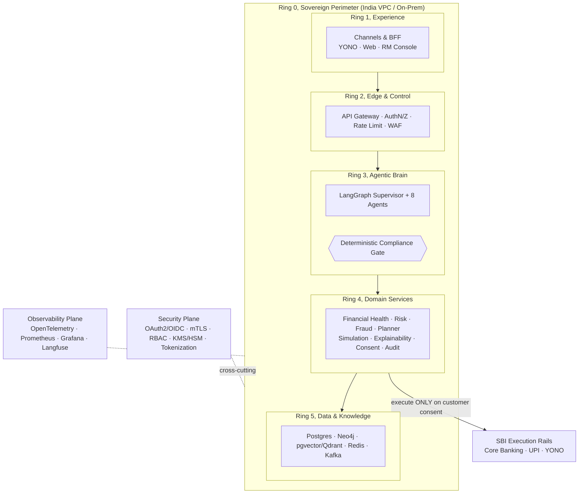

### 1.1 Guiding principles

| # | Principle | What it means concretely in this architecture |
|---|-----------|-----------------------------------------------|
| P1 | **Human-in-the-loop (HITL) by law and design** | Agents may `detect → predict → plan → simulate → certify → explain → propose`. The transition `propose → execute` is a **Temporal durable workflow** blocked on an explicit, signed customer approval signal. There is no code path from an agent to a money-movement rail. |
| P2 | **Deterministic compliance gate** | Every plan passes a rule engine (OPA/Rego + typed Python rules) that is **not an LLM**. It emits a signed *Compliance Certificate* or a *Veto*. LLM output can never bypass it. |
| P3 | **Security by default** | Zero-trust: mTLS between all services, OIDC on every hop, RBAC + ABAC on every sensitive route, field-level encryption at rest, PII tokenized before it ever reaches an LLM prompt. Deny-by-default network policies. |
| P4 | **Data localization** | All storage, compute, model inference, logging, and backups reside in India. No customer data or derived embeddings cross the border. LLM inference runs on India-hosted endpoints (self-hosted or sovereign-region managed). |
| P5 | **Glass-box explainability** | The Financial Wellbeing Score (FWS) is deterministic and pillar-decomposable. Every recommendation carries confidence, evidence transactions, the compliance certificate, and a reversibility flag. |
| P6 | **No-log / no-train on PII** | Prompts and completions are scrubbed and tokenized; PII is never persisted in logs or used for model training. LLM traces store token-references, not raw PII. |
| P7 | **Everything is an event, everything is audited** | State changes flow through Kafka; every decision is written to an append-only, hash-chained audit ledger for regulator and RM replay. |
| P8 | **Options, not orders** | The Planner always returns 2-3 plans; the customer chooses. Sentinel advises, it does not dictate. |

### 1.2 Architectural styles employed

- **Event-driven microservices**: Kafka as the backbone; services are independently deployable.
- **Orchestrated multi-agent (LangGraph supervisor pattern)**: a stateful graph, not a free-for-all agent swarm.
- **Durable workflow / Saga (Temporal)**: the long-lived, human-gated plan lifecycle survives restarts, timeouts, and reminders.
- **CQRS-lite**: write-optimized transactional stores + read-optimized feature store / projections.
- **Hexagonal / ports-and-adapters**: core-banking, market data, and compliance are reached through **MCP tool servers**, decoupling the brain from bank plumbing.

---

## 2. C4, System Context & Container

### 2.1 System Context (C4 Level 1)

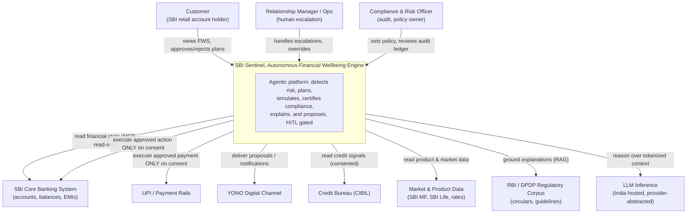

### 2.2 Container diagram (C4 Level 2)

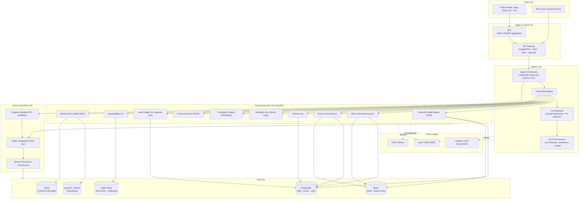

---

## 3. High-level component architecture

This is the definitive layered view. It shows the flow from channels through the deterministic
compliance gate to the execution rails, with the security and observability planes wrapping
everything, and names every mandated component.

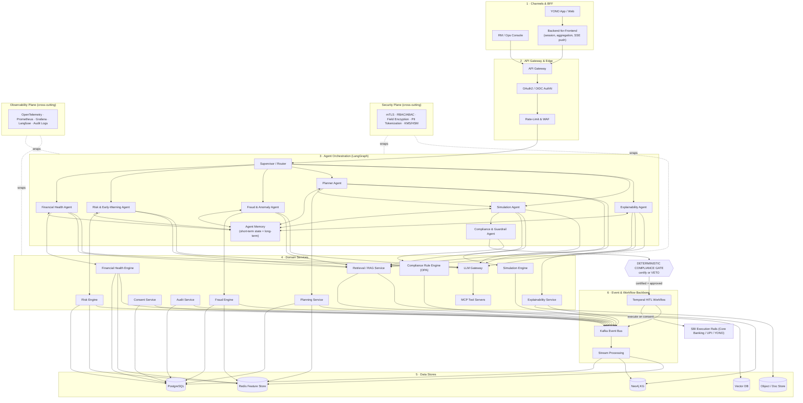

**Reading the diagram.** Requests enter only through the gateway (Layer 2), never directly to a
service. The Supervisor (Layer 3) fans work to specialist agents, which call typed domain
services (Layer 4). Planner → Simulation → Compliance is a strict pipeline; the **compliance
gate** is the only door to the Temporal workflow, and the workflow is the only path to the
execution rails, and only after the customer's signed approval. All state changes are
published to Kafka (Layer 6) and projected into the data stores (Layer 5). Security and
observability planes are mandatory sidecars on every service.

---

## 4. Agent orchestration deep-dive (LangGraph)

### 4.1 Supervisor + specialist topology

Sentinel uses the **LangGraph supervisor pattern**: a single stateful graph whose nodes are
agents and whose edges are conditional transitions governed by the shared `SentinelState`
object. The Supervisor owns routing and the HITL gate; specialists are stateless workers that
read/write the shared state and call MCP tools. This is deliberately **not** an autonomous swarm, every transition is auditable and deterministic where it must be.

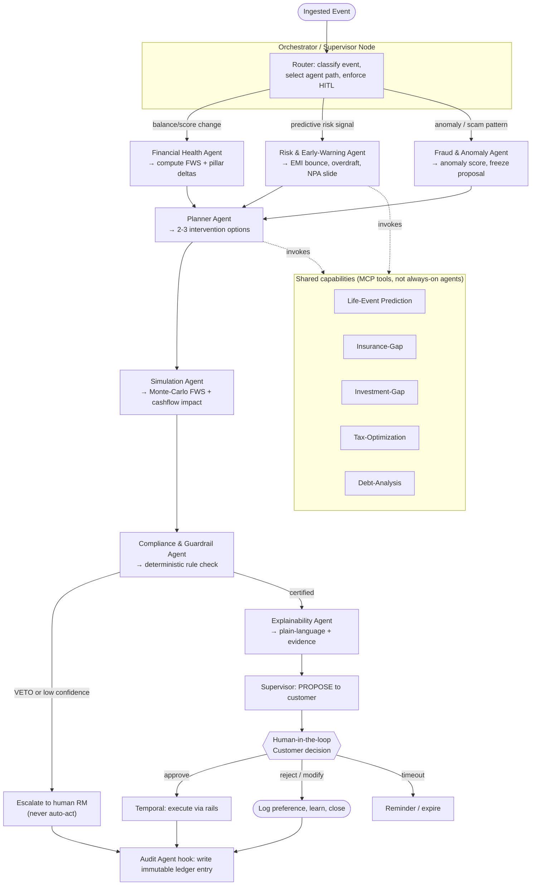

### 4.2 The intervention loop as a state machine

Every intervention is one instance of this state machine. States are persisted (LangGraph
checkpointer in Postgres/Redis) so a run can pause at the human gate for days and resume
exactly.

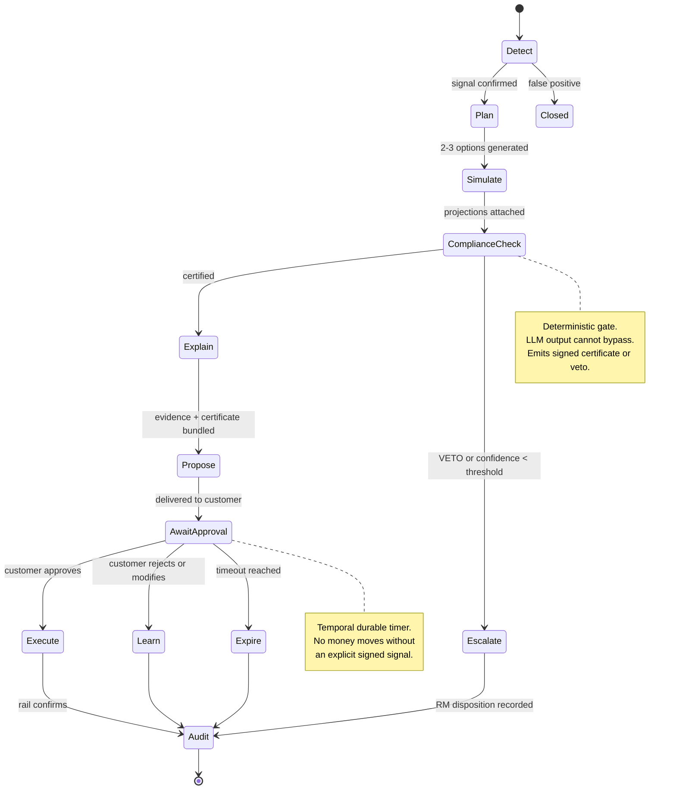

### 4.3 Shared state contract (`SentinelState`)

The agents communicate only through a typed, validated state object (Pydantic). This keeps the
graph deterministic and every field auditable.

| Field | Type | Written by | Purpose |
|-------|------|-----------|---------|
| `case_id` | UUID | Supervisor | Correlates the whole intervention across Kafka + audit |
| `customer_ref` | Tokenized ID | Supervisor | **No raw PII**: a tokenized reference only |
| `trigger_event` | Event | Supervisor | The Kafka event that opened the case |
| `fws_snapshot` | ScoreVector | Financial Health | Current FWS + 6 pillar sub-scores |
| `risk_findings` | list[Finding] | Risk / Fraud | Predicted issues with probability + horizon |
| `plans` | list[Plan] | Planner | 2-3 options, each with actions + reversibility |
| `simulations` | list[SimResult] | Simulation | Projected FWS/cashflow per plan |
| `certificate` | ComplianceCert \| Veto | Compliance | Signed decision object |
| `explanation` | Explanation | Explainability | Plain-language + evidence transactions |
| `decision` | Decision | Customer (via API) | approve / reject / modify + signature |
| `confidence` | float | each agent | Feeds the escalation threshold |
| `audit_trail` | list[AuditRef] | all | Hash-chained references for replay |

---

## 5. Event-driven architecture (Kafka + Temporal)

### 5.1 Topic taxonomy

Topics are namespaced `sentinel.<domain>.<entity>.<verb>`, keyed by `customer_ref` for ordered
per-customer processing, Avro-serialized against a Schema Registry, and partitioned for
50cr-scale throughput.

| Topic | Key | Producer | Consumers | Retention |
|-------|-----|----------|-----------|-----------|
| `sentinel.txn.event.raw` | customer_ref | Core-banking CDC | Risk, Fraud, Health stream jobs | 7d compacted |
| `sentinel.fws.score.updated` | customer_ref | Financial Health Engine | Orchestrator, projections | 30d |
| `sentinel.risk.finding.detected` | customer_ref | Risk Engine | Orchestrator | 90d |
| `sentinel.fraud.anomaly.flagged` | customer_ref | Fraud Engine | Orchestrator, RM console | 180d |
| `sentinel.plan.proposed` | case_id | Planner | Temporal, Explainability | 90d |
| `sentinel.compliance.decided` | case_id | Compliance Engine | Orchestrator, Audit | 7y (regulatory) |
| `sentinel.consent.changed` | customer_ref | Consent Service | all data consumers | 7y |
| `sentinel.plan.executed` | case_id | Temporal | Audit, Analytics | 7y |
| `sentinel.audit.appended` | case_id | Audit Service | SIEM, Analytics | 7y (WORM) |
| `sentinel.dlq.*` |, | any | On-call / replay tooling | 30d |

### 5.2 Canonical event envelope

```json
{
 "event_id": "uuid-v7",
 "event_type": "sentinel.risk.finding.detected",
 "occurred_at": "2026-07-04T09:14:22Z",
 "producer": "risk-engine@1.4.2",
 "schema_version": "2",
 "case_id": "uuid",
 "customer_ref": "TOK-3f9a...", // tokenized, never raw PII
 "trace_id": "otel-traceparent",
 "consent_context": { "purpose": "risk_monitoring", "consent_id": "uuid", "valid": true },
 "payload": {
 "finding": "emi_bounce_predicted",
 "probability": 0.71,
 "horizon_days": 9,
 "evidence_refs": ["txn:TOK-..","txn:TOK-.."]
 },
 "signature": "ed25519:..." // producer-signed for tamper-evidence
}
```

### 5.3 Full intervention, end-to-end sequence

This traces the demo golden path (Rajesh Kumar, predicted EMI bounce) across every layer,
including the Temporal durable wait for consent.

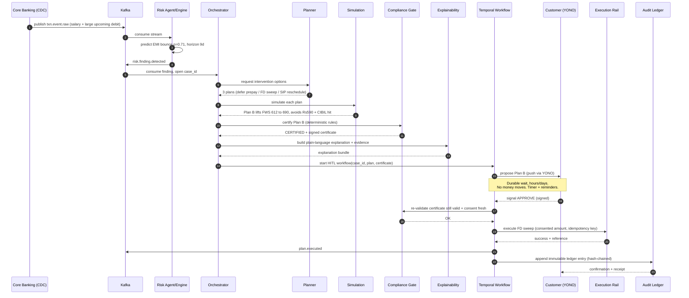

### 5.4 Why Temporal for the HITL lifecycle

- **Durability:** a proposal can wait days for a human without holding a thread or losing state.
- **Signals:** `approve`/`reject`/`modify` arrive as Temporal signals; the workflow reacts deterministically.
- **Timers & reminders:** built-in durable timers drive nudges and expiry.
- **Idempotency & Saga:** execution is wrapped in an activity with an idempotency key; compensation logic reverses partial failures.
- **Re-validation at execute-time:** compliance certificate freshness and consent validity are re-checked immediately before the rail call, closing the "approved-yesterday, revoked-today" gap.

---

## 6. Data architecture

### 6.1 Polyglot persistence, the right store for each shape of data

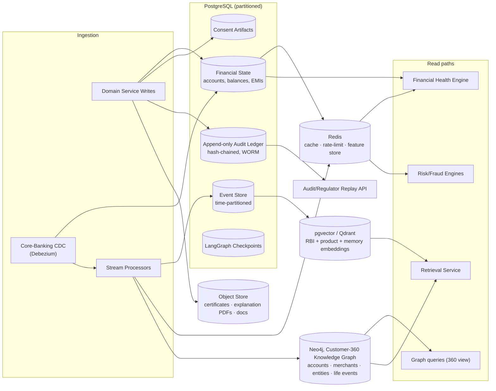

### 6.2 Store responsibilities

| Store | Holds | Key design choices |
|-------|-------|--------------------|
| **PostgreSQL** | Financial state, event store, append-only audit, consent artifacts, LangGraph checkpoints | Range-partitioned by month + hash sub-partition by `customer_ref`; audit table is INSERT-only with a `prev_hash` chain and a DB trigger blocking UPDATE/DELETE; row-level security by tenant/role; field-level encryption via `pgcrypto`/app-layer envelope encryption. |
| **Neo4j** | Customer-360 knowledge graph, accounts, merchants, counterparties, household/entities, life-event nodes | Powers relationship-aware fraud (mule rings), life-event inference, and graph-augmented RAG. Labels + relationship properties carry confidence + provenance. |
| **pgvector / Qdrant** | Dense embeddings for RBI/DPDP corpus, SBI product docs, and per-customer memory | HNSW index; namespaced collections (`regulatory`, `product`, `memory:{customer_ref}`); embeddings generated by an India-hosted embedding model; memory is consent-scoped and TTL-governed. |
| **Redis** | Hot feature store, response cache, rate-limit counters, distributed locks | Feature store serves sub-10ms reads to Risk/Health engines; Feast optional as the offline/online sync layer. |
| **Object Store** | Compliance certificates, explanation artifacts, source documents | Versioned, WORM bucket for certificates (regulatory retention), server-side encrypted with KMS keys. |

### 6.3 Append-only audit ledger design

The audit ledger is a **hash-chained, insert-only** table. Each row stores `entry_hash =
H(prev_hash || canonical_payload)`. A periodic job anchors the latest hash to a WORM object and
(optionally) an internal notarization service, giving tamper-evidence without a public
blockchain. Regulators and RMs replay any `case_id` end-to-end from this ledger.

---

## 7. RAG & retrieval layer

Every customer-facing explanation and every compliance rationale is **grounded**: no
free-floating LLM claims. Retrieval is hybrid (lexical + semantic + graph) with a reranker, over
a curated, versioned corpus.

```mermaid
flowchart TB
 subgraph corpus["Grounding Corpus (versioned, India-hosted)"]
 rbi["RBI circulars & master directions"]
 dpdp["DPDP Act & rules"]
 prod["SBI product docs<br/>(MF, Life, loans, deposits)"]
 pol["Internal suitability & sales policy"]
 mem["Per-customer memory<br/>(consent-scoped)"]
 end

 subgraph index["Indexing Pipeline"]
 chunk["Chunk + metadata tag<br/>(source, date, jurisdiction)"]
 emb["Embed (India-hosted model)"]
 bm["BM25 lexical index"]
 end

 corpus --> chunk --> emb --> vec[("Vector DB")]
 chunk --> bm[("OpenSearch BM25")]

 subgraph query["Query-time Hybrid Retrieval"]
 q["Agent query + tokenized context"]
 dense["Dense search (HNSW)"]
 lex["Lexical search (BM25)"]
 graph["Graph expansion (Neo4j)"]
 fuse["Reciprocal Rank Fusion"]
 rerank["Cross-encoder reranker"]
 filt["Consent + jurisdiction filter"]
 end

 q --> dense --> vec
 q --> lex --> bm
 q --> graph --> neo[("Neo4j")]
 dense & lex & graph --> fuse --> rerank --> filt --> ctx["Grounded context pack<br/>(with citations)"]
 ctx --> llmgw["LLM Gateway → reasoning"]

 subgraph mcpservers["MCP Tool Servers (typed, audited)"]
 m1["core-banking-mcp (read-only)"]
 m2["compliance-mcp (rule lookups)"]
 m3["market-data-mcp (rates, NAVs)"]
 m4["retrieval-mcp (this pipeline)"]
 end
 llmgw --> mcpservers
```

**Guarantees.** (1) Every retrieved chunk carries a citation `{source, section, date}` surfaced
in the explanation. (2) A **consent + jurisdiction filter** runs after fusion so a customer's
memory is never retrieved without a valid consent purpose, and only India-jurisdiction sources
are served. (3) MCP standardizes tool access so the reasoning layer is decoupled from bank
plumbing and every tool call is typed, rate-limited, and logged.

---

## 8. Compliance & guardrails architecture

The compliance engine is the architectural keystone and the moat. It is **deterministic**: a
rule engine, not an LLM, so its verdicts are reproducible and defensible in a regulatory audit.

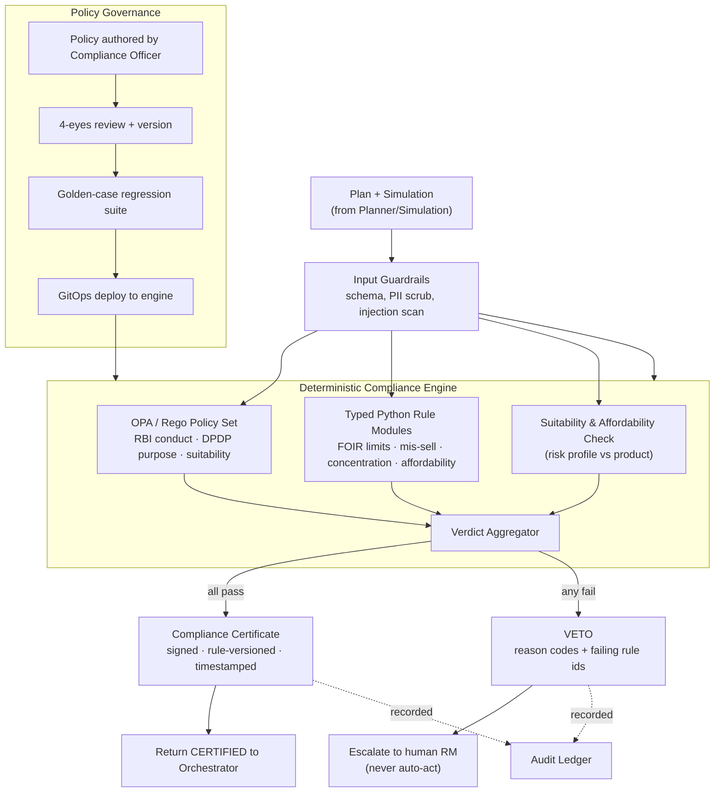

### 8.1 The veto path (non-negotiable)

- The Compliance Agent's LLM reasoning **cannot** substitute for the deterministic verdict, the
 LLM may draft rationale, but pass/fail is computed by OPA + Python only.
- A **VETO** short-circuits the entire loop: the plan never reaches the customer or the rails; the
 case escalates to a human RM with reason codes.
- **Low confidence** (any agent below the configured threshold) is treated like a veto → escalate.
- The **certificate is re-validated at execute-time** inside the Temporal workflow (§5.4), so a
 stale or superseded certificate cannot execute.

### 8.2 Compliance Certificate (contents)

`{ case_id, plan_id, verdict: CERTIFIED, rule_set_version, checks:[{rule_id, status,
evidence_ref}], suitability_score, dpdp_purpose, valid_until, signer, signature }`. The
certificate is stored in the WORM object bucket and referenced from the audit ledger.

---

## 9. Consent & audit layers

### 9.1 DPDP consent artifact lifecycle

Every data use is bound to a **purpose-specific, revocable** consent artifact. Sentinel is
consent-first: a processing path checks a valid consent before touching customer data, and
consumers subscribe to `sentinel.consent.changed` so revocation propagates immediately.

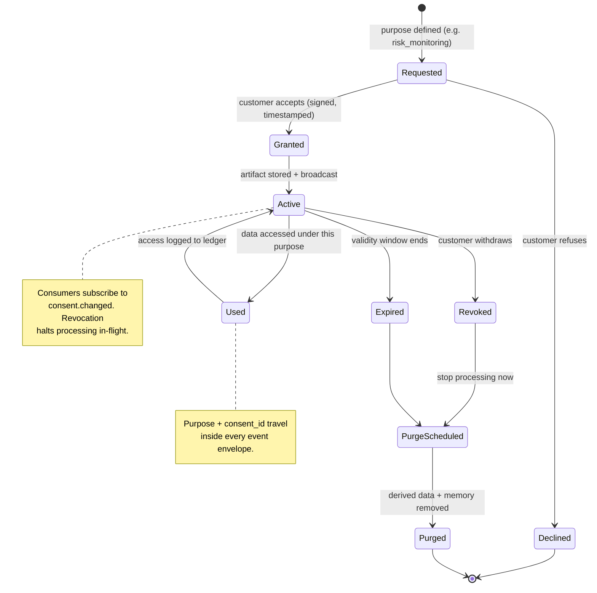

### 9.2 Consent + audit interplay

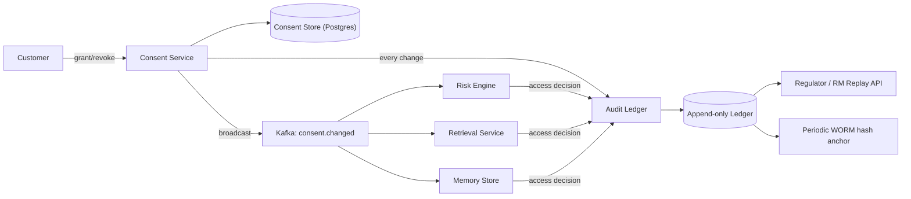

The audit ledger records **who/what/when/why** for every decision, data access, consent change,
compliance verdict, and execution, hash-chained and independently replayable. This is what makes
Sentinel *deployable* by a regulated bank, not merely demonstrable.

---

## 10. Security architecture

Zero-trust throughout: no implicit trust between services, strong identity on every hop, and PII
minimized before it ever nears an LLM.

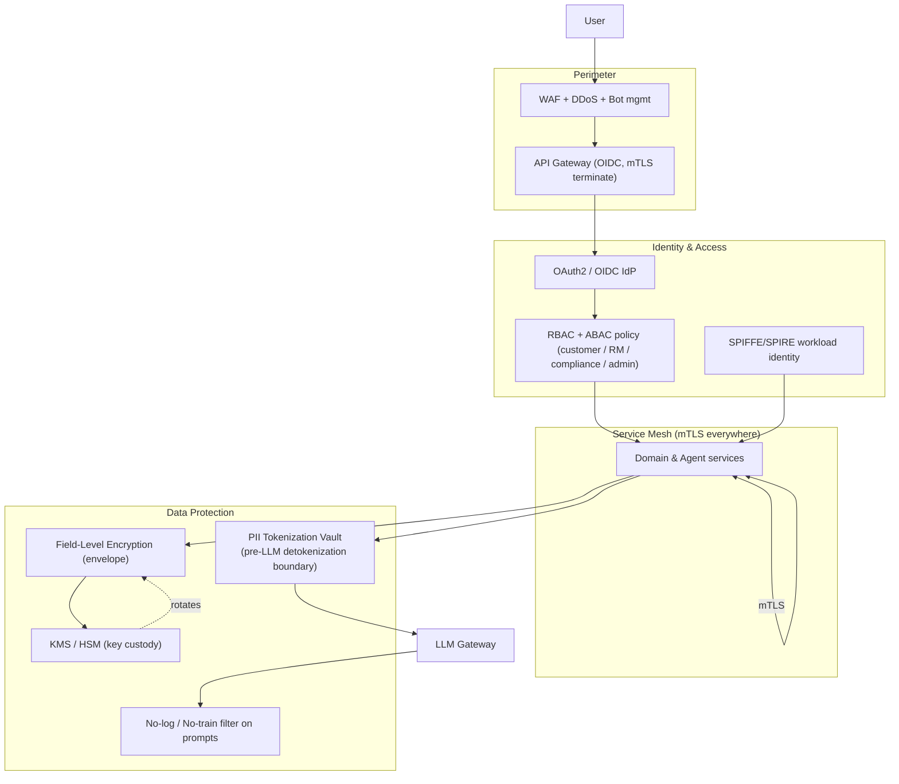

### 10.1 Controls summary

| Domain | Control |
|--------|---------|
| **AuthN** | OAuth2/OIDC for users; SPIFFE/SPIRE workload identity for services. |
| **AuthZ** | RBAC + ABAC on every route; least privilege; DB row-level security by role. |
| **Transport** | mTLS between all services via service mesh; TLS 1.3 at edge. |
| **PII** | Tokenized at ingestion; **only tokenized refs enter LLM prompts**; detokenization is a narrow, audited boundary. |
| **Encryption at rest** | Field-level envelope encryption for sensitive columns; KMS/HSM key custody; per-tenant keys. |
| **No-log/no-train** | Prompt/response scrubbing; LLM traces store token refs; contractual + technical no-train on any hosted inference. |
| **Secrets** | Vault; no secrets in code, images, or logs; short-lived credentials. |
| **Network** | Deny-by-default NetworkPolicies; private subnets; egress allow-list to sanctioned endpoints only. |

### 10.2 Threat model summary (STRIDE)

| Threat | Vector | Mitigation |
|--------|--------|-----------|
| **Spoofing** | Forged service/user identity | OIDC + mTLS + SPIFFE; signed event envelopes. |
| **Tampering** | Altered plan or audit record | Hash-chained audit ledger; signed certificates; WORM anchoring. |
| **Repudiation** | "I never approved that" | Signed customer approval signal captured in Temporal + ledger. |
| **Information disclosure** | PII leak via prompts/logs | Tokenization boundary; no-log/no-train; field encryption. |
| **Denial of service** | Flood the gateway/agents | Rate-limits, WAF, backpressure on Kafka consumers, tiered processing. |
| **Elevation of privilege** | Agent triggers money movement | **No code path** agent→rail; only Temporal after signed consent + re-validated certificate. |
| **Prompt injection** | Malicious data in retrieved content | Input guardrails, retrieval provenance filtering, deterministic compliance gate downstream of any LLM output. |

---

## 11. Observability & monitoring

Three correlated signal planes, metrics, traces, logs, plus a dedicated **LLM observability**
plane (Langfuse) for agent traces, token cost, and evals. Every signal shares the `trace_id`
from the event envelope, so one intervention is followable end-to-end.

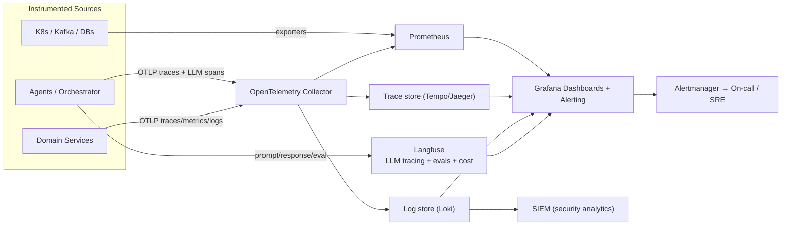

### 11.1 SLOs

| Service | SLI | SLO target |
|---------|-----|-----------|
| API Gateway | p99 latency | < 300 ms |
| FWS computation | freshness after txn | < 60 s (Tier-1 customers) |
| Risk detection → proposal | end-to-end | < 5 min for high-severity |
| Compliance gate | decision latency | p99 < 800 ms |
| Availability | customer-facing APIs | 99.95% monthly |
| LLM grounding | citation-backed responses | 100% (hard gate, no citation, no send) |
| Agent eval | Langfuse groundedness score | ≥ 0.9 rolling; regression blocks deploy |

### 11.2 LLM-specific observability (Langfuse)

- Full agent-trace of every node in the LangGraph run (inputs are tokenized).
- Token + cost accounting per case and per agent.
- Automated **evals**: groundedness, suitability-adherence, PII-leak detection, and
 compliance-consistency, run in CI on a golden set; a regression blocks deployment.

---

## 12. Deployment topology

Sentinel runs on **Kubernetes inside an India-localized sovereign-cloud VPC or on-prem cluster**.
Nothing, data, models, logs, or backups, leaves India.

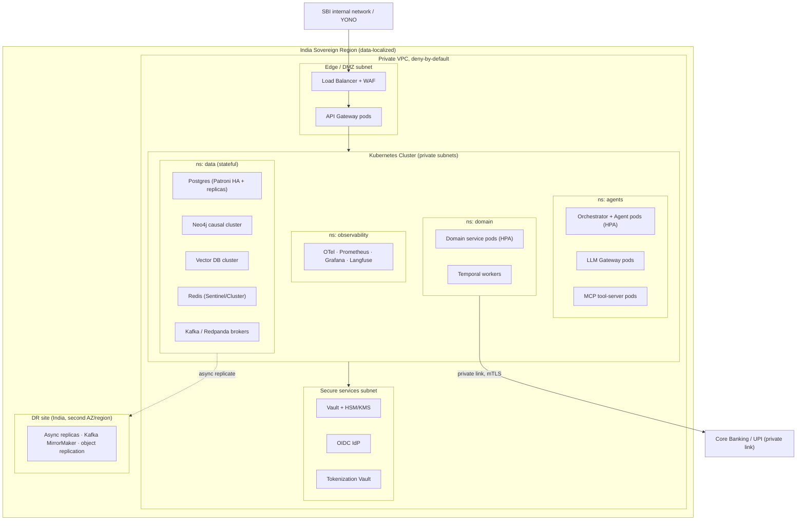

### 12.1 Environments & release

| Environment | Purpose | Data |
|-------------|---------|------|
| **Dev** | Feature work; Redpanda + docker-compose parity | Synthetic only |
| **UAT** | Integration + compliance golden-case suite | Masked/tokenized |
| **Staging** | Prod-mirror, perf + DR drills | Tokenized subset |
| **Production** | Live | Real, encrypted, localized |

Release via **GitOps (Argo CD)**, progressive delivery (canary + automated rollback on SLO
regression), and image signing/SBOM scanning in CI. Compliance policy bundles ship through the
same GitOps flow with 4-eyes approval (§8).

### 12.2 HA / DR

- **HA:** multi-AZ K8s; Postgres Patroni with sync replicas; Neo4j causal cluster; Kafka RF≥3;
 stateless services horizontally auto-scaled (HPA/KEDA on Kafka lag).
- **DR:** warm standby in a second India AZ/region; async streaming replication; Kafka
 MirrorMaker; **RPO ≤ 5 min, RTO ≤ 30 min**; quarterly failover drills; audit ledger + WORM
 bucket cross-replicated.

---

## 13. Scalability & performance

Sentinel is designed for **SBI scale, 50cr+ customers**. Continuously reasoning over every
customer with an LLM is neither necessary nor affordable, so processing is **tiered** and most
work is deterministic; the expensive agentic loop is reserved for customers with an active signal.

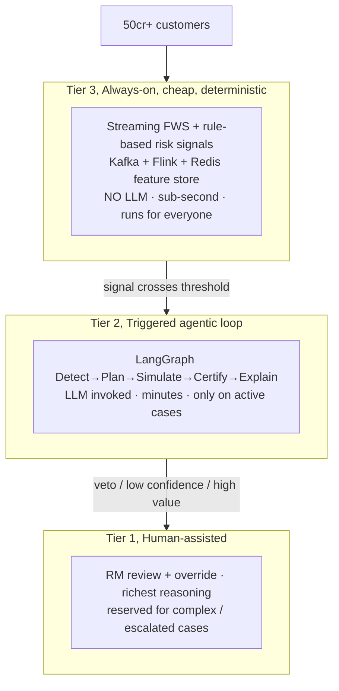

### 13.1 Scaling tactics

| Concern | Tactic |
|---------|--------|
| **Fan-out over 50cr customers** | Kafka partitioning by `customer_ref`; consumer groups scale with KEDA on lag; deterministic Tier-3 handles the base load with no LLM. |
| **LLM cost & latency** | Only Tier-2 triggers invoke the LLM; prompt caching; small-model routing for classification vs. large for planning; batch embedding jobs offline. |
| **Hot reads** | Redis feature store serves FWS pillars and features at <10 ms; read replicas for Postgres. |
| **Write throughput** | Time-partitioned + hash-subpartitioned tables; CDC-driven projections instead of synchronous joins. |
| **Graph queries** | Neo4j read replicas; pre-computed 360 projections for common traversals. |
| **Backpressure** | Bounded consumer concurrency; DLQ + replay; circuit breakers on MCP tool calls to core banking. |
| **Elasticity** | HPA on CPU/RPS for stateless tiers; scheduled scale-up around salary-credit cycles (month-end spikes). |

### 13.2 Indicative capacity targets

- Tier-3 stream: **> 1M txn events/sec** aggregate across partitions.
- FWS freshness: **< 60 s** after a qualifying transaction for prioritized cohorts.
- Active agentic cases: **hundreds of thousands concurrent**, each a durable Temporal workflow.
- Audit ledger: append-only, partitioned, 7-year regulatory retention with WORM anchoring.

---

## 14. Component-to-technology matrix

| Architecture component | Primary technology | Where it lives |
|------------------------|--------------------|----------------|
| Agent Orchestrator | LangGraph supervisor (Python 3.12) | ns: agents |
| 8 Specialist Agents | LangGraph nodes + MCP tools | ns: agents |
| Financial Health Engine (FWS) | FastAPI + deterministic scoring | ns: domain |
| Event Processing | Kafka/Redpanda + Flink/Faust | ns: data |
| Memory (short/long term) | LangGraph checkpointer (Postgres/Redis) + pgvector memory | ns: data |
| Planning | Planner service (FastAPI) + MCP capability tools | ns: domain |
| Simulation | Monte-Carlo / what-if engine (FastAPI + NumPy) | ns: domain |
| Compliance Engine | OPA/Rego + typed Python rules | ns: domain |
| Consent Layer | Consent service (DPDP) + Postgres store | ns: domain |
| Audit Layer | Append-only hash-chained ledger (Postgres + WORM) | ns: domain / data |
| Knowledge Graph | Neo4j causal cluster | ns: data |
| Vector Database | pgvector / Qdrant (HNSW) | ns: data |
| LLM Layer | LLM Gateway (provider-abstracted) + India-hosted inference | ns: agents |
| API Layer | Kong/APISIX gateway + FastAPI/Node BFF | edge / ns: domain |
| Observability | OpenTelemetry + Tempo + Loki | ns: observability |
| Monitoring | Prometheus + Grafana + Alertmanager | ns: observability |
| LLM tracing/evals | Langfuse | ns: observability |
| Security | OIDC IdP + service mesh mTLS + Vault/HSM + Tokenization Vault | secure subnet |
| Explainability | Explainability service + evidence bundler + citation grounding | ns: domain |
| Durable HITL workflow | Temporal | ns: domain |

---

## Appendix A, Cross-cutting invariants (assertions that must always hold)

1. **No agent has a code path to a money-movement rail.** Execution is reachable only from a
 Temporal workflow, only after a signed customer approval, only with a re-validated compliance
 certificate and fresh consent.
2. **No raw PII enters an LLM prompt or a log.** Only tokenized references cross those boundaries.
3. **No customer-facing claim ships without a citation** from the grounding corpus.
4. **No plan reaches the customer without a CERTIFIED deterministic compliance verdict.**
5. **No data leaves India.** Storage, compute, inference, logs, and backups are all localized.
6. **Every decision is append-only audited and independently replayable.**

These six invariants are the difference between a hackathon demo and a system SBI can actually
deploy. The architecture above exists to enforce them.
