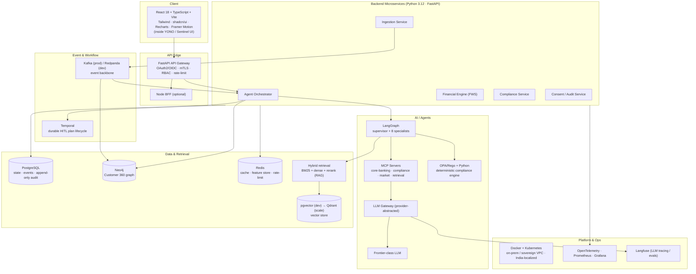

# SBI Sentinel, Complete Tech Stack

> Companion to `docs/00-MASTER-CONCEPT.md` (source of truth) and
> `docs/05-adr/ARCHITECTURE-DECISIONS.md` (the *why* behind the load-bearing choices).
> This document is the *what*, every technology, its role, and a one-line justification,
> organized by category. Where a choice differs between local development and production at
> SBI scale, both are stated. All customer data stays on-prem / in a sovereign-cloud VPC,
> localized in India (ADR-011).

**Design principles baked into every choice:** regulated-bank grade, self-hostable inside a
sovereign VPC, auditable, explainable, and consistent with the non-negotiable *"the AI proposes,
the customer approves, the bank executes."*

---

## Stack at a glance

**Dev-vs-prod at a glance:** Redpanda (dev) → Apache Kafka (prod) · pgvector (dev) → Qdrant
(scale) · single-node Docker Compose (dev) → Kubernetes on sovereign VPC (prod) · local
Temporalite/Temporal-dev (dev) → HA Temporal cluster (prod).

---

## Frontend

| Technology | Role | Justification |
|---|---|---|
| **React 18** | UI framework | Mature, ubiquitous, concurrent rendering; aligns with YONO's web/app stack and the team's velocity. |
| **TypeScript 5.x** | Language | Static types across a data-dense financial UI catch whole classes of bugs before runtime. |
| **Vite 5** | Build tool / dev server | Near-instant HMR and fast production builds; lean, modern toolchain over legacy CRA. |
| **TailwindCSS 3** | Styling | Utility-first, consistent design tokens, fast iteration without CSS sprawl. |
| **shadcn/ui** | Component library | Accessible, unstyled-by-default Radix primitives owned in-repo, no vendor lock, easy to theme to SBI's design language. |
| **Recharts 2** | Financial charts | Declarative React charts for FWS pillars, cashflow, and simulation projections (see Charts/Viz). |
| **Framer Motion 11** | Animation | Purposeful motion for the proposal/approve flow; makes the HITL gate feel like a product, not friction. |
| **TanStack Query** | Server-state / data fetching | Caching, retries, and stale-while-revalidate for the agent/plan APIs; less hand-rolled state. |
| **React Hook Form + Zod** | Forms + validation | Type-safe, schema-validated inputs (consent, approvals) shared with backend contracts. |
| **Vitest + Testing Library** | Frontend tests | Fast unit/component tests colocated with Vite (see Testing). |

---

## Backend

| Technology | Role | Justification |
|---|---|---|
| **Python 3.12** | Primary backend language | First-class ecosystem for AI/agents, ML, and data; team fluency; matches LangGraph/MCP tooling. |
| **FastAPI** | Microservice + API framework | Async, high-performance, Pydantic-typed, auto-OpenAPI, ideal for typed agent/compliance/consent services. |
| **Pydantic v2** | Schema / validation | Runtime-enforced typed contracts at every service boundary; the schema layer for guardrails. |
| **Uvicorn + Gunicorn** | ASGI server / process manager | Production-grade async serving with worker management. |
| **Node.js 20 + Fastify** *(optional BFF)* | Backend-for-frontend | Optional thin BFF to shape/aggregate responses for the React UI where it reduces client complexity. |
| **gRPC / Protobuf** *(internal)* | Service-to-service RPC | Typed, efficient inter-service calls where REST overhead isn't warranted. |
| **Poetry / uv** | Dependency + env management | Reproducible, locked Python environments across dev and CI. |

**Microservices:** API gateway, agent-orchestrator, financial-engine, compliance, consent,
audit, ingestion, each independently deployable and scalable (per master concept §7).

---

## Database & Storage

| Technology | Role | Dev vs. Prod | Justification |
|---|---|---|---|
| **PostgreSQL 16** | System of record: financial state, events, **append-only audit** | Same everywhere | ACID, partitioning, mature, self-hostable; the truth for money/audit must be transactional and time-tested (ADR-004/005). |
| **Neo4j 5** | Customer 360 knowledge graph | Same (community/dev → enterprise HA prod) | Multi-hop relationships (accounts, merchants, beneficiaries, life events, fraud rings) as cheap traversals, not brittle JOINs (ADR-004). |
| **pgvector → Qdrant** | Vector store for semantic retrieval | **pgvector (dev)** → **Qdrant (scale)** | Start colocated in Postgres with zero new infra; graduate to a dedicated HNSW engine for scale/filtering (ADR-003). |
| **Redis 7** | Cache, rate-limit, feature store | Same | Low-latency cache, rate-limiting, and online feature serving for risk/anomaly models. |
| **Feast** *(optional)* | Feature store framework | Prod-optional | Consistent online/offline features for FWS and risk models when the ML footprint grows. |
| **MinIO** (S3-compatible) | Object storage | Self-hosted in VPC | Documents (OCR inputs), model artifacts, deck/report exports, S3 API without leaving the sovereign boundary. |
| **PgBouncer** | Postgres connection pooling | Prod | Scales connection load across many microservices at bank volume. |

---

## AI / Agents / LLM

| Technology | Role | Justification |
|---|---|---|
| **LangGraph** | Multi-agent orchestration (supervisor + 8 specialists) | Stateful, deterministic graph with checkpointing + human-interrupt, a *provable* pipeline, not emergent chat (ADR-001). |
| **Model Context Protocol (MCP)** | Standardized tool access | Uniform, auditable, security-scoped tool contract to core-banking, compliance, market data, retrieval (ADR-002). |
| **a frontier-class LLM** | Deep reasoning: planning, complex explanation | Best-in-class nuanced, safety-sensitive reasoning for high-stakes financial advice (ADR-010). |
| **a frontier-class LLM** | High-volume / low-latency steps: routing, classification, drafting | Strong quality at lower cost/latency for the frequent, lighter agent steps (ADR-010). |
| **LLM Gateway** (internal, provider-abstracted) | Model routing, PII policy, cost/rate control, fallbacks | Single control point for no-train/no-log-PII, tiered model use, and zero-cost vendor swap (ADR-010). |
| **OPA / Rego + Python rules** | Deterministic compliance & guardrail engine | Reproducible CERTIFY/VETO verdicts + Compliance Certificate, the moat; the LLM never self-certifies (ADR-008). |
| **Guardrails (I/O validation layer)** | LLM boundary safety | Schema enforcement, PII tokenization, prompt-injection/jailbreak defense at every model call. |
| **the model provider SDK** | LLM client (behind the gateway) | Official, well-supported client wrapped by the gateway so agent code stays provider-agnostic. |

---

## Retrieval / RAG

| Technology | Role | Justification |
|---|---|---|
| **RAG pipeline** | Ground every explanation in RBI/DPDP/SBI product sources | Knowledge stays external, current, and **citable**: updatable same-day without retraining (ADR-006). |
| **BM25 / lexical retriever** | Exact-token recall | Catches circular numbers, section refs, product codes, and figures that embeddings miss (ADR-007). |
| **Dense retriever (embeddings + ANN)** | Semantic recall | Matches paraphrase and intent ("liquidity crunch" ≈ "cash shortfall") (ADR-007). |
| **Cross-encoder reranker** | Precision ordering of fused candidates | Cheapest large win in grounding precision; keeps top-k small and prompt-cost low (ADR-007). |
| **Embedding model** (in-VPC / via gateway) | Vectorize corpus + queries | Consistent, sovereign-boundary embeddings for the vector store. |
| **Metadata filtering** | Temporal + scope correctness | Enforces "circular in force on this date" and per-customer memory isolation. |
| **Corpus:** RBI circulars, DPDP, SBI product docs, customer memory | Grounded knowledge base | The authoritative, versioned source of regulatory/product truth for explanations. |

---

## Event & Workflow

| Technology | Role | Dev vs. Prod | Justification |
|---|---|---|---|
| **Apache Kafka** | Event backbone: ingestion, fan-out, replayable log, projection source | **Redpanda (dev)** → **Apache Kafka (prod)** | Decoupled, elastic, replayable signal stream for an always-on watcher at scale (ADR-005). |
| **Redpanda** | Kafka-API-compatible broker for local dev | Dev | Single-binary, lightweight, no ZooKeeper, fast inner loop with the same Kafka API. |
| **Temporal** | Durable, resumable HITL plan lifecycle | Temporal-dev (dev) → HA cluster (prod) | Owns the multi-day propose→wait-for-consent→execute→audit saga with exactly-once activities (ADR-005/009). |
| **Schema Registry** (Avro/Protobuf) | Event contract governance | Prod | Versioned, validated event schemas across producers/consumers. |
| **CDC (Debezium)** *(optional)* | Change-data-capture into Kafka | Prod-optional | Streams core-banking/Postgres changes as events and projects into Neo4j read model. |

---

## Deployment & Cloud

| Technology | Role | Justification |
|---|---|---|
| **Docker** | Containerization | Reproducible builds from dev to prod; the packaging unit for every service. |
| **Kubernetes** | Orchestration / scaling | Self-healing, horizontally scalable workloads for bank-scale traffic. |
| **On-prem / sovereign-cloud VPC (India)** | Deployment boundary | RBI data-localization + DPDP compliance by construction; data never leaves the sovereign boundary (ADR-011). |
| **Helm** | K8s packaging / release management | Templated, versioned, repeatable deployments across environments. |
| **Terraform** | Infrastructure-as-code | Auditable, reviewable provisioning of the VPC and clusters. |
| **Argo CD** | GitOps continuous delivery | Declarative, git-driven deploys with drift detection, auditable release trail. |
| **NGINX / Envoy** | Ingress / service mesh edge | TLS termination, routing, and mTLS enforcement at the edge. |
| **Docker Compose** | Local dev orchestration | One-command local stack (Redpanda, Postgres+pgvector, Neo4j, Redis, Temporal-dev). |

---

## Monitoring / Observability

| Technology | Role | Justification |
|---|---|---|
| **OpenTelemetry** | Distributed tracing + metrics standard | Vendor-neutral instrumentation across every service and agent hop; end-to-end request/plan tracing. |
| **Prometheus** | Metrics collection + alerting | De-facto standard time-series metrics; SLO alerting for the always-on system. |
| **Grafana** | Dashboards / visualization | Unified ops + business dashboards (latency, throughput, NPA/fraud KPIs). |
| **Langfuse** | LLM tracing, evaluation, prompt analytics | Self-hostable LLM observability, traces every agent reasoning step and runs retrieval/answer evals (ADR-006/007). |
| **Alertmanager** | Alert routing | Routes Prometheus alerts to on-call with dedup/silencing. |
| **Jaeger / Tempo** | Trace storage + query | Backends for OpenTelemetry traces for deep debugging. |

---

## Logging

| Technology | Role | Justification |
|---|---|---|
| **Structured JSON logging** (structlog) | Application logs | Machine-parseable, queryable logs, **no PII, tokenized refs only** (master concept non-negotiable). |
| **Append-only audit ledger** (PostgreSQL, partitioned) | Immutable regulatory record | Every proposal, certificate, consent, and execution is written immutably for RBI/DPDP audit. |
| **Loki** | Log aggregation | Grafana-native, cost-efficient log store correlated with metrics/traces. |
| **Fluent Bit** | Log shipping | Lightweight collection/forwarding from pods to Loki. |
| **PII redaction filter** | Log hygiene enforcement | Guarantees no-log-PII at the pipeline level, not just by convention. |

---

## Authentication / Security

| Technology | Role | Justification |
|---|---|---|
| **OAuth2 / OIDC** (Keycloak) | Authentication + identity | Standard, self-hostable IdP inside the VPC; SSO with SBI identity. |
| **mTLS** | Service-to-service auth | Mutual TLS on every internal hop, zero-trust between microservices. |
| **RBAC** | Authorization | Least-privilege roles on every sensitive path (customer, RM, admin, agent-service). |
| **Field-level encryption** | Data-at-rest protection | Encrypts sensitive columns beyond disk encryption; keys in a vault. |
| **PII tokenization** | Data minimization | Prompts/logs/graph carry tokenized refs, never raw PII, enforced at gateway and log filter. |
| **HashiCorp Vault** | Secrets + key management | No secrets in repo/env files; centralized rotation and audit of keys/tokens. |
| **Consent ledger** | DPDP consent artifacts | Every data use + action carries a stored, auditable consent record (ADR-009). |
| **OPA / Rego** | Policy-as-code (authz + compliance) | Deterministic, versioned policy decisions, reused by the compliance engine (ADR-008). |
| **Rate limiting + WAF** | Abuse / attack defense | Redis-backed rate limits and edge WAF against abuse and injection. |

---

## Speech (Indic ASR / Bhashini)

| Technology | Role | Justification |
|---|---|---|
| **Bhashini** (Govt. of India) | Indic ASR + TTS + translation | Sovereign, government-backed multilingual speech across 22 scheduled languages, right for SBI's pan-India, multilingual customer base. |
| **AI4Bharat IndicASR / IndicTrans2** | Indic speech + translation models | Open, India-focused, self-hostable models as an in-VPC fallback to Bhashini for offline/sovereign paths. |
| **WebRTC / MediaRecorder** | In-app audio capture | Browser-native voice capture for the Sentinel/YONO conversational surface. |

---

## OCR (Document ingestion)

| Technology | Role | Justification |
|---|---|---|
| **PaddleOCR** | Primary OCR engine (incl. Indic scripts) | Strong multilingual/Indic-script accuracy, self-hostable in-VPC, no document leaves the boundary. |
| **Tesseract 5** | Fallback OCR | Mature, offline OCR fallback for standard documents. |
| **pdfplumber / PyMuPDF** | PDF text + layout extraction | Extracts native text/tables from digital PDFs before falling back to OCR. |
| **Document ingestion pipeline** | Statements, policy docs, KYC into structured data | Feeds the financial engine and Customer 360 with parsed, validated fields. |

---

## Charts / Viz

| Technology | Role | Justification |
|---|---|---|
| **Recharts 2** | Primary React charting | FWS pillar breakdowns, cashflow trends, simulation projections, declarative and React-native. |
| **visx / D3** *(bespoke)* | Custom visualizations | For anything Recharts can't express (custom gauges, the FWS glass-box explainer). |
| **Mermaid** | Diagrams-as-code | Architecture/flow diagrams in docs (rendered in this repo), versioned with the code. |

*(A consistent, accessible, light/dark chart system is applied per the dataviz design system.)*

---

## Analytics / ML

| Technology | Role | Justification |
|---|---|---|
| **Financial Wellbeing scoring engine** (custom, deterministic) | Glass-box FWS across 6 pillars | Every point traceable to a transaction, explainable by design for RBI (master concept §3). |
| **scikit-learn** | Risk & anomaly models | Interpretable classical models (EMI-bounce, liquidity, overdraft), preferred over opaque nets for auditability. |
| **XGBoost / LightGBM** | Gradient-boosted risk models | Strong tabular performance with feature-importance explainability for early-warning. |
| **NumPy + SciPy** | Monte-Carlo simulation engine | Powers the Simulation Agent's what-if FWS/cashflow projections per plan (master concept §4). |
| **pandas / Polars** | Data wrangling | Feature engineering and financial aggregations; Polars for large-frame performance. |
| **SHAP** | Model explainability | Per-prediction feature attributions feeding the Explainability Ledger. |
| **MLflow** | Experiment tracking + model registry | Versioned, auditable model lineage, which model version produced which score. |

---

## Testing

| Technology | Role | Justification |
|---|---|---|
| **pytest** | Backend unit/integration tests | Rich Python testing; the harness for compliance-rule and agent-node tests. |
| **Vitest + React Testing Library** | Frontend unit/component tests | Fast, Vite-native tests for UI and the approval flow. |
| **Playwright** | End-to-end tests | Drives the full golden-path (propose → approve → execute) across the real UI. |
| **Schemathesis** | API contract/property tests | Fuzzes FastAPI endpoints against their OpenAPI schema. |
| **Testcontainers** | Integration test infra | Spins up real Postgres/Kafka/Neo4j/Redis in tests, no mocks for data-layer behavior. |
| **Locust / k6** | Load & performance testing | Validates bank-scale throughput and latency SLOs. |
| **Deterministic compliance-rule test suite** | Regulatory correctness | Golden tests proving each RBI/DPDP/suitability rule certifies/vetoes exactly as specified (ADR-008). |
| **Langfuse evals** | LLM/RAG quality gates | Retrieval and answer-grounding evals run in CI to catch regressions in explanation quality. |

---

## CI/CD

| Technology | Role | Justification |
|---|---|---|
| **GitHub Actions** *(or GitLab CI on-prem)* | Pipeline automation | Runs build/test/scan on every change; GitLab CI variant when kept inside the sovereign boundary. |
| **Argo CD** | GitOps deployment | Declarative, auditable, git-driven delivery to Kubernetes (see Deployment). |
| **Trivy** | Container + dependency vulnerability scanning | Blocks known-vulnerable images/deps before release (security bar). |
| **Semgrep / CodeQL** | Static application security testing (SAST) | Catches injection, secrets, and unsafe patterns in CI. |
| **Gitleaks** | Secret scanning | Prevents credentials/tokens/PII from ever being committed. |
| **Ruff + Black + mypy** | Python lint / format / type-check | Enforces the quality and type bar on every PR. |
| **ESLint + Prettier** | Frontend lint / format | Consistent, error-catching frontend quality gate. |
| **pre-commit** | Local gate | Runs lint/format/secret-scan before code leaves a developer's machine. |
| **SBOM (Syft)** | Software bill of materials | Supply-chain transparency and auditability of every dependency. |

---

## Environment matrix (dev vs. prod)

| Concern | Development | Production (SBI scale) |
|---|---|---|
| Event bus | Redpanda (single binary) | Apache Kafka (HA, multi-broker) |
| Vector store | pgvector (in Postgres) | Qdrant (dedicated, HNSW, sharded) |
| Workflow engine | Temporal-dev / Temporalite | Temporal HA cluster |
| Orchestration | Docker Compose | Kubernetes on sovereign VPC (India) |
| Neo4j | Community / single node | Enterprise, causal cluster (HA) |
| LLM access | a frontier-class LLM via gateway (dev keys) | a frontier-class LLM via gateway + optional in-VPC model, no-train terms |
| Secrets | `.env` (local, git-ignored) | HashiCorp Vault |
| CI/CD | GitHub Actions | GitLab CI on-prem + Argo CD GitOps |
| Data residency | Local | India-localized, sovereign VPC, DPDP-consent-gated |

---

### Notes

- **Nothing customer-sensitive leaves India or the sovereign VPC.** Every third-party dependency
 above is either self-hostable inside the boundary or accessed through the LLM gateway under
 contractual no-train / no-retention terms with PII tokenized first (ADR-010/011).
- **Deterministic where it's legal, probabilistic where it's helpful.** ML/LLM components *ground
 and explain*; the FWS engine and the OPA/Rego compliance engine *decide*, reproducibly and
 auditably (ADR-006/008).
- **Versions** are indicative current-major choices; exact patch versions are pinned in the
 respective lockfiles (`poetry.lock` / `uv.lock`, `pnpm-lock.yaml`) and Helm charts.
