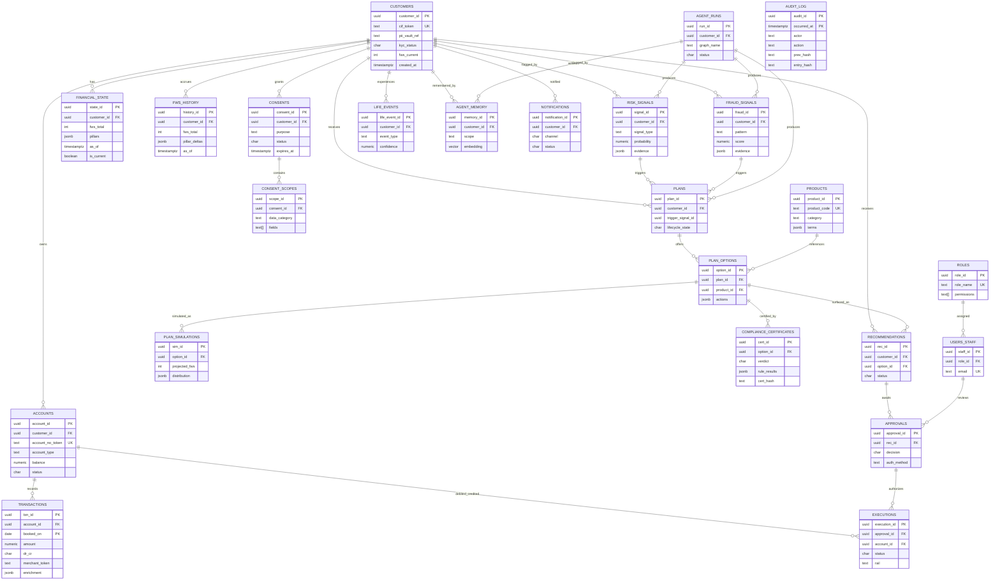
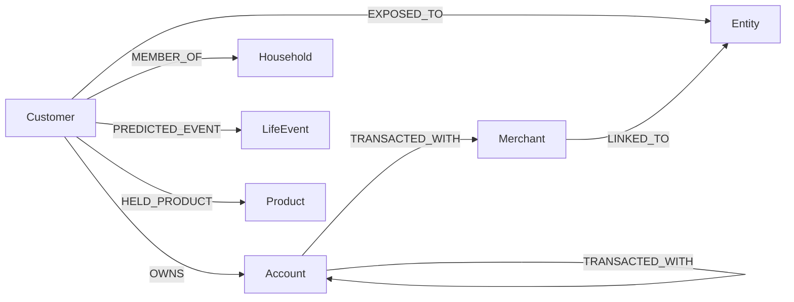

# SBI Sentinel, Database Design (Data Layer)

> Consistent with `docs/00-MASTER-CONCEPT.md`. Money never moves autonomously; the data
> layer must make **detect → predict → plan → simulate → compliance-check → explain →
> propose → approve → execute → audit** provable, replayable, and DPDP-safe.

**Scale target:** ~50 crore (500M) customers, ~2-4 billion accounts, tens of billions of
transactions/year. Every design choice below is justified against that scale, against
RBI explainability/audit expectations, and against DPDP (consent + erasure).

---

## 1. Overview & datastore responsibilities

Sentinel uses a **polyglot persistence** model. Each store owns the workload it is best at;
Postgres is the **system of record**, everything else is derived or specialized and can be
rebuilt from Postgres + the event log.

| Store | Role | What lives here | Why here |
|---|---|---|---|
| **PostgreSQL 16** (+ Citus/partitioning) | System of record | Customers, accounts, transactions (partitioned), financial_state + fws_history, risk/fraud signals, plans/options/simulations, compliance certificates, recommendations, **consent ledger**, approvals, executions, **append-only audit_log**, agent_runs/memory, products, RBAC. | ACID, strong constraints, partitioning, row-level security, mature ops. Financial truth must be transactional and auditable. |
| **Neo4j 5** | Customer-360 knowledge graph | Customer↔Account↔Merchant↔Entity↔Household↔LifeEvent↔Product relationships, fraud rings, exposure paths. | Multi-hop traversals (household exposure, merchant fraud rings) are O(1) per hop in a graph, pathological joins in SQL. |
| **pgvector (in Postgres) + Qdrant** | Vector / semantic memory | Embeddings for RBI+DPDP corpus, SBI product docs, and long-term **customer memory**. pgvector for tightly-coupled per-customer memory (co-located with RLS + consent), Qdrant for the large shared RAG corpora needing HNSW + hybrid at scale. | RAG grounding for every explanation; agent long-term memory. Keeping customer memory in Postgres inherits RLS + DPDP erasure for free. |
| **Redis 7** | Hot path | FWS cache, feature store, rate-limit, sessions, idempotency locks, Kafka consumer dedupe TTL. | Sub-ms reads for the dashboard and agent hot loop. |
| **Kafka / Redpanda** | Event backbone | Domain events emitted via the Postgres **outbox**; agent triggers; execution/audit fan-out. | Durable, replayable event log; decouples detection from action. |
| **Object store (S3-compatible, in-VPC)** | Blobs | Rendered compliance certificate PDFs, explanation exports, large simulation traces. | Cheap immutable blob storage; Postgres holds the hash + pointer. |

**Golden rules**
- Postgres is authoritative for **money, consent, and audit**. Neo4j/Qdrant/Redis are
 **derived** and rebuildable from Postgres + Kafka.
- Nothing is deleted destructively where audit or consent applies, see §5, §11.
- Every read of customer data is gated by an **active consent scope** (§4/§11) and RLS.

---

## 2. Relational ER model (PostgreSQL)

### 2.1 Mermaid ER diagram



### 2.2 DDL

Conventions: PostgreSQL 16, UUID v7 (time-ordered) PKs, `timestamptz` everywhere,
`numeric(18,2)` for money (never float), all customer tables carry `customer_id` for
Row-Level Security. Extensions assumed: `pgcrypto`, `vector` (pgvector), `pg_partman`
(partition automation), `btree_gin`.

```sql
CREATE EXTENSION IF NOT EXISTS pgcrypto;
CREATE EXTENSION IF NOT EXISTS vector;
CREATE EXTENSION IF NOT EXISTS btree_gin;

-- =====================================================================
-- REFERENCE / RBAC
-- =====================================================================
CREATE TABLE roles (
 role_id uuid PRIMARY KEY DEFAULT gen_random_uuid(),
 role_name text UNIQUE NOT NULL, -- rm, compliance_officer, fraud_analyst, admin, auditor
 permissions text[] NOT NULL DEFAULT '{}', -- e.g. {plan.review, execution.trigger, audit.read}
 created_at timestamptz NOT NULL DEFAULT now()
);

CREATE TABLE users_staff (
 staff_id uuid PRIMARY KEY DEFAULT gen_random_uuid(),
 role_id uuid NOT NULL REFERENCES roles(role_id),
 employee_code text UNIQUE NOT NULL,
 email text UNIQUE NOT NULL,
 display_name text NOT NULL,
 branch_code text,
 mfa_enrolled boolean NOT NULL DEFAULT false,
 status char(1) NOT NULL DEFAULT 'A', -- A active, S suspended, D disabled
 created_at timestamptz NOT NULL DEFAULT now(),
 last_login_at timestamptz
);
CREATE INDEX idx_staff_role ON users_staff(role_id);

CREATE TABLE products (
 product_id uuid PRIMARY KEY DEFAULT gen_random_uuid(),
 product_code text UNIQUE NOT NULL, -- SBILIFE-ETERNAL, SBIMF-SMALLCAP-DG
 provider text NOT NULL, -- SBI Life, SBI Mutual Fund
 category text NOT NULL, -- term_life, health, mutual_fund, fd, rd, loan
 name text NOT NULL,
 risk_grade text, -- for suitability checks
 terms jsonb NOT NULL DEFAULT '{}', -- premium bands, lock-in, expense ratio, sum-assured rules
 is_active boolean NOT NULL DEFAULT true,
 valid_from date,
 valid_to date,
 created_at timestamptz NOT NULL DEFAULT now()
);
CREATE INDEX idx_products_category ON products(category) WHERE is_active;
CREATE INDEX idx_products_terms_gin ON products USING gin (terms);

-- =====================================================================
-- CORE CUSTOMER / ACCOUNT
-- =====================================================================
CREATE TABLE customers (
 customer_id uuid PRIMARY KEY DEFAULT gen_random_uuid(),
 cif_token text UNIQUE NOT NULL, -- tokenized CIF (real CIF in PII vault)
 pii_vault_ref text NOT NULL, -- pointer to encrypted PII record (name, PAN, Aadhaar-ref)
 kyc_status char(1) NOT NULL DEFAULT 'P',-- P pending, V verified, R rejected
 segment text, -- salaried, sme, hni, priority
 home_branch text,
 risk_profile text, -- conservative, moderate, aggressive
 fws_current int CHECK (fws_current BETWEEN 0 AND 1000),
 fws_band text, -- Critical / At-Risk / Stable / Thriving
 data_region text NOT NULL DEFAULT 'IN', -- localization guard
 is_erased boolean NOT NULL DEFAULT false, -- DPDP erasure tombstone
 created_at timestamptz NOT NULL DEFAULT now(),
 updated_at timestamptz NOT NULL DEFAULT now()
);
CREATE INDEX idx_customers_segment ON customers(segment);
CREATE INDEX idx_customers_fws_band ON customers(fws_band) WHERE NOT is_erased;

CREATE TABLE accounts (
 account_id uuid PRIMARY KEY DEFAULT gen_random_uuid(),
 customer_id uuid NOT NULL REFERENCES customers(customer_id),
 account_no_token text UNIQUE NOT NULL, -- tokenized account number
 account_type text NOT NULL, -- savings, current, home_loan, credit_card, fd, rd, demat
 ifsc text,
 currency char(3) NOT NULL DEFAULT 'INR',
 balance numeric(18,2) NOT NULL DEFAULT 0,
 available_balance numeric(18,2),
 credit_limit numeric(18,2),
 emi_amount numeric(18,2),
 emi_due_day smallint, -- day of month EMI falls due
 opened_on date,
 status char(1) NOT NULL DEFAULT 'A', -- A active, D dormant, C closed, F frozen
 created_at timestamptz NOT NULL DEFAULT now()
);
CREATE INDEX idx_accounts_customer ON accounts(customer_id);
CREATE INDEX idx_accounts_type_status ON accounts(account_type, status);

-- =====================================================================
-- TRANSACTIONS (RANGE-partitioned by month on booked_on)
-- =====================================================================
CREATE TABLE transactions (
 txn_id uuid NOT NULL DEFAULT gen_random_uuid(),
 account_id uuid NOT NULL,
 customer_id uuid NOT NULL, -- denormalized for RLS + partition-local filtering
 booked_on date NOT NULL, -- partition key
 value_ts timestamptz NOT NULL,
 amount numeric(18,2) NOT NULL,
 dr_cr char(1) NOT NULL, -- D debit, C credit
 channel text, -- upi, neft, imps, card, ach, cash, standing_instruction
 counterparty_token text,
 merchant_token text,
 mcc text, -- merchant category code
 category text, -- enriched: groceries, emi, salary, rent, discretionary
 running_balance numeric(18,2),
 ref_no text,
 enrichment jsonb NOT NULL DEFAULT '{}', -- geo, device, model scores, tags
 PRIMARY KEY (txn_id, booked_on) -- PK must include partition key
) PARTITION BY RANGE (booked_on);

-- Example monthly partitions (automated in prod via pg_partman, 1-month premake, retention policy)
CREATE TABLE transactions_2026_06 PARTITION OF transactions
 FOR VALUES FROM ('2026-06-01') TO ('2026-07-01');
CREATE TABLE transactions_2026_07 PARTITION OF transactions
 FOR VALUES FROM ('2026-07-01') TO ('2026-08-01');
-- older-than-retention partitions are DETACHed and archived to object store (cold), not dropped.

-- Indexes are created per-partition (inherited from parent template in PG16):
CREATE INDEX idx_txn_acct_time ON transactions (account_id, value_ts DESC);
CREATE INDEX idx_txn_customer_time ON transactions (customer_id, booked_on DESC);
CREATE INDEX idx_txn_category ON transactions (category);
CREATE INDEX idx_txn_merchant ON transactions (merchant_token) WHERE merchant_token IS NOT NULL;
CREATE INDEX idx_txn_enrichment_gin ON transactions USING gin (enrichment);

-- =====================================================================
-- FINANCIAL STATE (current snapshot + history) -- glass-box FWS
-- =====================================================================
CREATE TABLE financial_state (
 state_id uuid PRIMARY KEY DEFAULT gen_random_uuid(),
 customer_id uuid NOT NULL REFERENCES customers(customer_id),
 fws_total int NOT NULL CHECK (fws_total BETWEEN 0 AND 1000),
 fws_band text NOT NULL,
 -- pillar breakdown: each pillar -> {raw, normalized, weight, subscore, drivers[]}
 pillars jsonb NOT NULL, -- cashflow, buffer, debt, protection, wealth, behavioral
 inputs_hash text NOT NULL, -- hash of feature vector used (reproducibility)
 computed_by_run uuid, -- FK-ish -> agent_runs.run_id
 as_of timestamptz NOT NULL DEFAULT now(),
 is_current boolean NOT NULL DEFAULT true
);
-- Exactly one current row per customer:
CREATE UNIQUE INDEX uq_fs_current ON financial_state(customer_id) WHERE is_current;
CREATE INDEX idx_fs_pillars_gin ON financial_state USING gin (pillars);

CREATE TABLE fws_history (
 history_id uuid PRIMARY KEY DEFAULT gen_random_uuid(),
 customer_id uuid NOT NULL REFERENCES customers(customer_id),
 fws_total int NOT NULL,
 fws_band text NOT NULL,
 pillar_scores jsonb NOT NULL, -- snapshot of 6 subscores
 pillar_deltas jsonb NOT NULL, -- change vs previous snapshot, per pillar
 reason text, -- what moved it (salary credit, missed EMI, plan executed)
 source_event uuid, -- link to triggering event/execution
 as_of timestamptz NOT NULL
);
CREATE INDEX idx_fwsh_customer_time ON fws_history (customer_id, as_of DESC);

-- =====================================================================
-- SIGNALS
-- =====================================================================
CREATE TABLE risk_signals (
 signal_id uuid PRIMARY KEY DEFAULT gen_random_uuid(),
 customer_id uuid NOT NULL REFERENCES customers(customer_id),
 account_id uuid REFERENCES accounts(account_id),
 signal_type text NOT NULL, -- emi_bounce, overdraft, liquidity_crunch, npa_slide
 probability numeric(5,4) NOT NULL CHECK (probability BETWEEN 0 AND 1),
 horizon_days int, -- days until predicted event
 severity text NOT NULL, -- low, medium, high, critical
 evidence jsonb NOT NULL, -- contributing txns, features, model version
 detected_by_run uuid,
 status char(1) NOT NULL DEFAULT 'O', -- O open, R resolved, X expired, S suppressed
 detected_at timestamptz NOT NULL DEFAULT now(),
 resolved_at timestamptz
);
CREATE INDEX idx_risk_cust_status ON risk_signals(customer_id, status);
CREATE INDEX idx_risk_open_sev ON risk_signals(severity, detected_at DESC) WHERE status='O';

CREATE TABLE fraud_signals (
 fraud_id uuid PRIMARY KEY DEFAULT gen_random_uuid(),
 customer_id uuid NOT NULL REFERENCES customers(customer_id),
 account_id uuid REFERENCES accounts(account_id),
 txn_id uuid, -- offending txn (partition-independent ref)
 pattern text NOT NULL, -- mule_ring, otp_scam, card_testing, velocity_spike
 score numeric(5,4) NOT NULL CHECK (score BETWEEN 0 AND 1),
 ring_id text, -- links to graph merchant/mule ring id
 evidence jsonb NOT NULL,
 action_taken text, -- none, flagged, freeze_proposed, frozen_on_consent
 detected_by_run uuid,
 status char(1) NOT NULL DEFAULT 'O',
 detected_at timestamptz NOT NULL DEFAULT now()
);
CREATE INDEX idx_fraud_cust_status ON fraud_signals(customer_id, status);
CREATE INDEX idx_fraud_ring ON fraud_signals(ring_id) WHERE ring_id IS NOT NULL;

-- =====================================================================
-- PLAN LIFECYCLE
-- =====================================================================
CREATE TABLE plans (
 plan_id uuid PRIMARY KEY DEFAULT gen_random_uuid(),
 customer_id uuid NOT NULL REFERENCES customers(customer_id),
 trigger_type text NOT NULL, -- risk, fraud, gap_insurance, gap_investment, health
 trigger_signal_id uuid, -- risk_signals.signal_id or fraud_signals.fraud_id
 title text NOT NULL,
 lifecycle_state char(1) NOT NULL DEFAULT 'D',
 -- D draft, S simulated, C compliance_pending, V vetoed,
 -- R ready(certified), P proposed, A approved, X executed, E expired, J rejected
 created_by_run uuid,
 created_at timestamptz NOT NULL DEFAULT now(),
 updated_at timestamptz NOT NULL DEFAULT now()
);
CREATE INDEX idx_plans_cust_state ON plans(customer_id, lifecycle_state);

CREATE TABLE plan_options (
 option_id uuid PRIMARY KEY DEFAULT gen_random_uuid(),
 plan_id uuid NOT NULL REFERENCES plans(plan_id) ON DELETE CASCADE,
 product_id uuid REFERENCES products(product_id), -- if the action involves a product
 label text NOT NULL, -- "Sweep from FD", "Defer partial prepay", "Shift SIP date"
 rank smallint NOT NULL, -- 1..3
 actions jsonb NOT NULL, -- ordered, reversible action spec (rail, amount, source, target)
 est_cost numeric(18,2),
 est_benefit numeric(18,2),
 reversible boolean NOT NULL DEFAULT true,
 created_at timestamptz NOT NULL DEFAULT now()
);
CREATE INDEX idx_options_plan ON plan_options(plan_id);

CREATE TABLE plan_simulations (
 sim_id uuid PRIMARY KEY DEFAULT gen_random_uuid(),
 option_id uuid NOT NULL REFERENCES plan_options(option_id) ON DELETE CASCADE,
 method text NOT NULL, -- monte_carlo, deterministic_whatif
 iterations int,
 baseline_fws int NOT NULL,
 projected_fws int NOT NULL,
 fws_delta int GENERATED ALWAYS AS (projected_fws - baseline_fws) STORED,
 cashflow_impact jsonb NOT NULL, -- month-by-month projection
 distribution jsonb NOT NULL, -- p5/p50/p95, VaR, bounce probability after plan
 model_version text,
 ran_at timestamptz NOT NULL DEFAULT now()
);
CREATE INDEX idx_sim_option ON plan_simulations(option_id);

CREATE TABLE compliance_certificates (
 cert_id uuid PRIMARY KEY DEFAULT gen_random_uuid(),
 option_id uuid NOT NULL REFERENCES plan_options(option_id) ON DELETE CASCADE,
 verdict char(1) NOT NULL, -- P pass/certify, V veto, E escalate
 rule_engine_version text NOT NULL,
 rule_results jsonb NOT NULL, -- [{rule_id, name, source(RBI/DPDP/suitability), status, evidence}]
 checks_passed int NOT NULL,
 checks_failed int NOT NULL,
 suitability_ok boolean,
 misselling_ok boolean,
 consent_ok boolean,
 cert_pdf_ref text, -- object-store pointer to rendered certificate
 cert_hash text NOT NULL, -- sha256 over canonical cert body (tamper-evidence)
 issued_by_run uuid,
 issued_at timestamptz NOT NULL DEFAULT now()
);
CREATE INDEX idx_cert_option ON compliance_certificates(option_id);
CREATE INDEX idx_cert_verdict ON compliance_certificates(verdict);

CREATE TABLE recommendations (
 rec_id uuid PRIMARY KEY DEFAULT gen_random_uuid(),
 customer_id uuid NOT NULL REFERENCES customers(customer_id),
 plan_id uuid NOT NULL REFERENCES plans(plan_id),
 option_id uuid NOT NULL REFERENCES plan_options(option_id),
 cert_id uuid NOT NULL REFERENCES compliance_certificates(cert_id),
 confidence numeric(5,4) NOT NULL,
 headline text NOT NULL, -- plain-language recommendation
 explanation jsonb NOT NULL, -- evidence txns, why, pillar impact, grounded citations
 status char(1) NOT NULL DEFAULT 'P',-- P proposed, A approved, J rejected, X expired
 surfaced_channel text, -- yono, rm_dashboard, sms
 expires_at timestamptz,
 created_at timestamptz NOT NULL DEFAULT now()
);
CREATE INDEX idx_rec_cust_status ON recommendations(customer_id, status);

-- =====================================================================
-- CONSENT (DPDP ledger), see §11
-- =====================================================================
CREATE TABLE consents (
 consent_id uuid PRIMARY KEY DEFAULT gen_random_uuid(),
 customer_id uuid NOT NULL REFERENCES customers(customer_id),
 purpose text NOT NULL, -- fws_computation, cross_sell, fraud_freeze, data_share_partner
 purpose_text text NOT NULL, -- exact language shown to customer (versioned)
 policy_version text NOT NULL,
 status char(1) NOT NULL DEFAULT 'A',-- A active, W withdrawn, E expired
 lawful_basis text NOT NULL DEFAULT 'consent',
 granted_via text, -- yono, branch, ivr
 granted_at timestamptz NOT NULL DEFAULT now(),
 expires_at timestamptz,
 withdrawn_at timestamptz
);
CREATE INDEX idx_consents_cust_active ON consents(customer_id, purpose) WHERE status='A';

CREATE TABLE consent_scopes (
 scope_id uuid PRIMARY KEY DEFAULT gen_random_uuid(),
 consent_id uuid NOT NULL REFERENCES consents(consent_id) ON DELETE CASCADE,
 data_category text NOT NULL, -- transactions, balances, demographics, credit_bureau
 fields text[] NOT NULL, -- explicit field list (data minimization)
 allow_purposes text[] NOT NULL,
 retention_days int -- category-specific retention override
);
CREATE INDEX idx_scopes_consent ON consent_scopes(consent_id);

-- =====================================================================
-- APPROVAL & EXECUTION (human-in-the-loop gate)
-- =====================================================================
CREATE TABLE approvals (
 approval_id uuid PRIMARY KEY DEFAULT gen_random_uuid(),
 rec_id uuid NOT NULL REFERENCES recommendations(rec_id),
 approver_type char(1) NOT NULL, -- C customer, R rm/staff (escalation)
 approver_ref text NOT NULL, -- customer_id token or staff_id
 decision char(1) NOT NULL, -- A approve, D decline
 auth_method text NOT NULL, -- yono_mpin, biometric, otp, rm_dual_control
 consent_id uuid REFERENCES consents(consent_id), -- consent captured at approval
 decided_at timestamptz NOT NULL DEFAULT now(),
 client_ip_token text,
 device_token text
);
CREATE INDEX idx_approvals_rec ON approvals(rec_id);

CREATE TABLE executions (
 execution_id uuid PRIMARY KEY DEFAULT gen_random_uuid(),
 approval_id uuid NOT NULL REFERENCES approvals(approval_id),
 account_id uuid NOT NULL REFERENCES accounts(account_id),
 idempotency_key text UNIQUE NOT NULL, -- prevents double-execution
 rail text NOT NULL, -- core_banking, upi, yono, standing_instruction
 action_spec jsonb NOT NULL, -- exactly what was sent to the rail
 amount numeric(18,2),
 status char(1) NOT NULL DEFAULT 'Q',-- Q queued, S sent, C confirmed, F failed, R reversed
 rail_ref text, -- core banking / UPI reference
 is_reversible boolean NOT NULL DEFAULT true,
 reversal_of uuid REFERENCES executions(execution_id),
 requested_at timestamptz NOT NULL DEFAULT now(),
 confirmed_at timestamptz,
 error jsonb
);
CREATE INDEX idx_exec_status ON executions(status) WHERE status IN ('Q','S');
CREATE INDEX idx_exec_account ON executions(account_id);

-- =====================================================================
-- LIFE EVENTS
-- =====================================================================
CREATE TABLE life_events (
 life_event_id uuid PRIMARY KEY DEFAULT gen_random_uuid(),
 customer_id uuid NOT NULL REFERENCES customers(customer_id),
 event_type text NOT NULL, -- marriage, childbirth, job_change, retirement, home_purchase
 predicted boolean NOT NULL DEFAULT true,
 confidence numeric(5,4),
 evidence jsonb, -- signals that implied it
 expected_on date,
 detected_at timestamptz NOT NULL DEFAULT now()
);
CREATE INDEX idx_life_cust ON life_events(customer_id, event_type);

-- =====================================================================
-- NOTIFICATIONS
-- =====================================================================
CREATE TABLE notifications (
 notification_id uuid PRIMARY KEY DEFAULT gen_random_uuid(),
 customer_id uuid NOT NULL REFERENCES customers(customer_id),
 rec_id uuid REFERENCES recommendations(rec_id),
 channel char(1) NOT NULL, -- P push, S sms, E email, I in-app
 template_code text NOT NULL,
 payload jsonb NOT NULL, -- rendered, PII-tokenized
 status char(1) NOT NULL DEFAULT 'Q',-- Q queued, S sent, D delivered, F failed, R read
 sent_at timestamptz,
 created_at timestamptz NOT NULL DEFAULT now()
);
CREATE INDEX idx_notif_cust_status ON notifications(customer_id, status);
```

Audit, agent, event, and vector tables have dedicated sections (§4, §5, §7) with their own DDL.

---

## 3. Indexes & performance (at 50-crore scale)

Design principle: **every hot query has a covering/supporting index; large tables are
partitioned so indexes stay B-tree-shallow and vacuum stays local.**

| Index | Table | Type | Why |
|---|---|---|---|
| `idx_txn_customer_time (customer_id, booked_on DESC)` | transactions | btree (per-partition) | Dashboard "recent activity" + FWS feature pulls hit one partition, one customer. Partition pruning + this index = index-only-ish scan over a few pages. |
| `idx_txn_acct_time (account_id, value_ts DESC)` | transactions | btree | Statement/ledger view per account. |
| `idx_txn_merchant … WHERE merchant_token IS NOT NULL` | transactions | **partial** btree | Fraud/merchant analytics without indexing the ~40% NULL merchant rows → smaller index, faster writes. |
| `idx_txn_enrichment_gin` | transactions | **GIN** | Query enrichment jsonb (`enrichment @> '{"geo":"risky"}'`, model tags) without exploding columns. |
| `uq_fs_current (customer_id) WHERE is_current` | financial_state | **partial unique** | Guarantees exactly one current snapshot per customer AND makes "get current FWS" a single-row lookup. |
| `idx_risk_open_sev (severity, detected_at DESC) WHERE status='O'` | risk_signals | **partial** btree | The alert queue only cares about OPEN signals; partial index is tiny relative to lifetime signal volume. |
| `idx_rec_cust_status (customer_id, status)` | recommendations | btree | "pending proposals for this customer" on YONO load. |
| `idx_consents_cust_active … WHERE status='A'` | consents | **partial** btree | Consent gate is on **every** data read, must be O(1); only active consents indexed. |
| `idx_exec_status … WHERE status IN ('Q','S')` | executions | **partial** btree | Execution worker polls only in-flight rows; index stays small forever. |
| `idx_products_terms_gin`, `idx_fs_pillars_gin` | products, financial_state | **GIN** | Ad-hoc jsonb filters (product terms, pillar drivers) for suitability + explainability. |
| HNSW on `agent_memory.embedding` | agent_memory | **pgvector HNSW** | Approximate-NN customer-memory recall in the agent loop. |

**Scale tactics**
- **Partitioning** (transactions, audit, outbox) keeps each partition + its indexes small
 enough to stay in cache and vacuum quickly; partition pruning turns table scans into a
 handful of pages.
- **Sharding**: at 50cr customers, horizontally shard by `customer_id` hash (Citus
 distributed tables or app-level shard routing). All customer-owned tables share the same
 distribution key so joins stay **co-located** (single-shard).
- **Denormalized `customer_id`** on transactions enables shard co-location and RLS without
 a join to accounts.
- **Partial indexes** on `status`/lifecycle columns keep operational queues indexing only
 "live" rows, so index size tracks working-set, not history.
- **BRIN** as an alternative on append-only time columns where range scans dominate (audit).
- **Read replicas** for analytics/RM dashboards; hot per-customer reads served from Redis (§10).

---

## 4. Event tables & outbox pattern

Sentinel is event-driven, but we never dual-write to Postgres and Kafka directly (risk of
divergence). Instead: **transactional outbox**: the domain change and the event row commit
in the **same transaction**; a relay ships outbox rows to Kafka; consumers dedupe via
`processed_events`.

```sql
-- Written in the SAME transaction as the domain change
CREATE TABLE event_outbox (
 outbox_id uuid PRIMARY KEY DEFAULT gen_random_uuid(),
 aggregate_type text NOT NULL, -- transaction, risk_signal, plan, execution, consent
 aggregate_id uuid NOT NULL,
 event_type text NOT NULL, -- txn.posted, risk.detected, plan.certified, exec.confirmed
 topic text NOT NULL, -- kafka topic (see mapping)
 partition_key text NOT NULL, -- usually customer_id -> per-customer ordering
 payload jsonb NOT NULL, -- CloudEvents envelope, PII-tokenized
 headers jsonb NOT NULL DEFAULT '{}',
 occurred_at timestamptz NOT NULL DEFAULT now(),
 published_at timestamptz, -- NULL until relay ships it
 status char(1) NOT NULL DEFAULT 'N' -- N new, P published, F failed
);
CREATE INDEX idx_outbox_unpublished ON event_outbox(occurred_at) WHERE status='N';

-- Consumer-side idempotency: dedupe by (consumer, event id)
CREATE TABLE processed_events (
 consumer_group text NOT NULL,
 event_id uuid NOT NULL, -- == outbox_id / CloudEvents id
 processed_at timestamptz NOT NULL DEFAULT now(),
 result char(1) NOT NULL DEFAULT 'S', -- S success, K skipped, F failed
 PRIMARY KEY (consumer_group, event_id)
);
-- Time-based cleanup; short-horizon dedupe (also mirrored in Redis with TTL, §10).
```

**Relay** (Debezium on `event_outbox` or a poller on `status='N'`) publishes then marks
`status='P'`. Effectively-once end-to-end = at-least-once delivery + consumer idempotency.

**Kafka topic mapping**

| Producer / source | Topic | Key | Primary consumers |
|---|---|---|---|
| Core-banking ingest | `sentinel.txn.posted` | customer_id | Risk agent, Fraud agent, FWS recompute, Neo4j sync |
| Risk agent | `sentinel.risk.detected` | customer_id | Orchestrator (spawn plan) |
| Fraud agent | `sentinel.fraud.detected` | customer_id | Orchestrator, freeze workflow, RBI-reporting sink |
| FWS engine | `sentinel.fws.updated` | customer_id | Cache invalidation (Redis), notifications |
| Compliance agent | `sentinel.plan.certified` / `.vetoed` | plan_id | Orchestrator, recommendation surfacer |
| Approval service | `sentinel.approval.granted` | customer_id | Execution worker |
| Execution worker | `sentinel.exec.confirmed` / `.failed` | customer_id | Audit writer, FWS recompute, notifications |
| Consent service | `sentinel.consent.changed` | customer_id | Data-access gate refresh, erasure pipeline |
| Any service | `sentinel.audit.append` | entity | Append-only audit writer (§5) |

`sentinel.*.dlq` dead-letter topics back every consumer for poison-message isolation.

---

## 5. Audit tables, immutability & tamper-evidence

`audit_log` is the **legal record** of every decision and action. It is append-only,
hash-chained, partitioned, and enforced immutable at the database level (no trust in app code).

```sql
CREATE TABLE audit_log (
 audit_id uuid NOT NULL DEFAULT gen_random_uuid(),
 occurred_at timestamptz NOT NULL DEFAULT now(), -- partition key
 actor_type text NOT NULL, -- agent, customer, staff, system
 actor_ref text NOT NULL, -- run_id / customer token / staff_id
 action text NOT NULL, -- risk.detected, plan.certified, approval.granted, exec.confirmed
 entity_type text NOT NULL,
 entity_id uuid NOT NULL,
 customer_id uuid, -- nullable for system events
 payload jsonb NOT NULL, -- tokenized before/after, evidence, model+rule versions
 prev_hash text NOT NULL, -- hash of the previous entry in this chain
 entry_hash text NOT NULL, -- sha256(prev_hash || canonical(payload) || occurred_at || action)
 seq bigint GENERATED ALWAYS AS IDENTITY,
 PRIMARY KEY (audit_id, occurred_at)
) PARTITION BY RANGE (occurred_at);

CREATE TABLE audit_log_2026_07 PARTITION OF audit_log
 FOR VALUES FROM ('2026-07-01') TO ('2026-08-01');
CREATE INDEX idx_audit_entity ON audit_log (entity_type, entity_id, occurred_at DESC);
CREATE INDEX idx_audit_customer ON audit_log (customer_id, occurred_at DESC);
CREATE INDEX brin_audit_time ON audit_log USING brin (occurred_at); -- cheap range scans on append-only data

-- ---- Immutability enforced in the database, not the app ----
CREATE OR REPLACE FUNCTION audit_no_mutate() RETURNS trigger AS $$
BEGIN
 RAISE EXCEPTION 'audit_log is append-only: % is forbidden', TG_OP;
END;
$$ LANGUAGE plpgsql;

CREATE TRIGGER trg_audit_no_update BEFORE UPDATE ON audit_log
 FOR EACH ROW EXECUTE FUNCTION audit_no_mutate();
CREATE TRIGGER trg_audit_no_delete BEFORE DELETE ON audit_log
 FOR EACH ROW EXECUTE FUNCTION audit_no_mutate();
CREATE TRIGGER trg_audit_no_truncate BEFORE TRUNCATE ON audit_log
 FOR EACH STATEMENT EXECUTE FUNCTION audit_no_mutate();

-- ---- Hash-chain on insert (tamper-evidence) ----
CREATE OR REPLACE FUNCTION audit_hash_chain() RETURNS trigger AS $$
DECLARE last_hash text;
BEGIN
 SELECT entry_hash INTO last_hash FROM audit_log
 ORDER BY seq DESC LIMIT 1;
 NEW.prev_hash := COALESCE(last_hash, repeat('0',64)); -- genesis
 NEW.entry_hash := encode(digest(
 NEW.prev_hash || NEW.action || NEW.entity_id::text ||
 NEW.payload::text || NEW.occurred_at::text, 'sha256'), 'hex');
 RETURN NEW;
END;
$$ LANGUAGE plpgsql;

CREATE TRIGGER trg_audit_chain BEFORE INSERT ON audit_log
 FOR EACH ROW EXECUTE FUNCTION audit_hash_chain();
```

**Design notes**
- **Append-only enforced by triggers** → even a compromised app role cannot UPDATE/DELETE.
 Grants further restrict the audit role to `INSERT, SELECT` only.
- **Hash-chain** (each entry binds the previous entry's hash) makes any retroactive edit
 detectable: recompute the chain and it diverges. Periodic **anchor**: publish the latest
 `entry_hash` daily to an external WORM/notary log for independent tamper-evidence.
- **Partitioned by month** + BRIN for cheap time-range regulatory pulls; old partitions are
 moved to **WORM object storage** (never dropped) to satisfy retention.
- **Retention**: audit and consent records kept per RBI/DPDP statutory minimums (audit
 typically 8-10 years for banking records); financial audit partitions are archived cold,
 not deleted. Even DPDP erasure (§11) tombstones the customer but **preserves audit** under
 the legal-obligation lawful basis (audit stores tokens, not raw PII).

---

## 6. Financial state modeling (explainability + time-travel)

The FWS is a **glass box**: every point traceable to transactions. The data model makes both
the *current* answer and *how it changed over time* first-class.

- **`financial_state`** holds the **current** snapshot (`is_current=true`, one per customer,
 enforced by the partial unique index). `pillars` jsonb stores, per pillar:
 `{raw, normalized, weight, subscore, drivers:[txn_ids/features], formula_version}`. So a
 UI can expand any pillar → its drivers → the exact transactions.
- **`fws_history`** appends an immutable row on every recompute with `pillar_scores`,
 `pillar_deltas`, a human `reason`, and `source_event`. This is the **time-series** behind
 the score sparkline and the "why did my score drop" answer.
- **`inputs_hash`** stores a hash of the exact feature vector used → **reproducibility**:
 re-running the FWS engine on the same inputs must yield the same score, provable in audit.
- **Time-travel / explainability**: to answer "what was Rajesh's FWS and pillar breakdown on
 1 Jun, and which transactions drove Debt Health down?", query `fws_history` for the
 `as_of` snapshot, read `pillar_scores`/`pillar_deltas`, and follow the driver `txn_ids`
 into the correct monthly `transactions` partition. Because transactions are immutable-ish
 append (corrections are reversal entries, not edits) and audit is append-only, the
 reconstruction is exact.
- **Recompute flow**: `txn.posted`/`exec.confirmed` → FWS engine recomputes → in one
 transaction: flip old `financial_state.is_current=false`, insert new current row, insert
 `fws_history` row, insert `event_outbox` (`fws.updated`), insert `audit_log`. Redis FWS
 cache invalidated on `fws.updated`.

---

## 7. Agent memory schema (short-term + long-term)

Two tiers, mirroring the agent architecture: ephemeral run scratch vs durable, vector-backed
customer memory.

```sql
-- Run-level (short-term): one row per agent/graph invocation
CREATE TABLE agent_runs (
 run_id uuid PRIMARY KEY DEFAULT gen_random_uuid(),
 customer_id uuid REFERENCES customers(customer_id),
 graph_name text NOT NULL, -- orchestrator, risk_agent, fraud_agent, planner, compliance...
 trigger_event uuid, -- outbox/event id that started it
 parent_run_id uuid REFERENCES agent_runs(run_id), -- supervisor -> specialist tree
 status char(1) NOT NULL DEFAULT 'R', -- R running, C completed, F failed, E escalated
 scratch jsonb NOT NULL DEFAULT '{}', -- SHORT-TERM working memory / graph state
 tool_calls jsonb NOT NULL DEFAULT '[]', -- MCP/tool trace for this run
 llm_trace_ref text, -- Langfuse trace id
 tokens_in int, tokens_out int,
 started_at timestamptz NOT NULL DEFAULT now(),
 ended_at timestamptz
);
CREATE INDEX idx_runs_cust ON agent_runs(customer_id, started_at DESC);
CREATE INDEX idx_runs_parent ON agent_runs(parent_run_id);

-- Long-term: durable, vector-backed per-customer memory
CREATE TABLE agent_memory (
 memory_id uuid PRIMARY KEY DEFAULT gen_random_uuid(),
 customer_id uuid NOT NULL REFERENCES customers(customer_id),
 scope text NOT NULL, -- preference, past_decision, risk_context, interaction, goal
 content text NOT NULL, -- natural-language memory (tokenized, no raw PII)
 embedding vector(1024) NOT NULL, -- pgvector; matches embedding model dim (§9)
 salience real NOT NULL DEFAULT 0.5, -- decay/priority weighting
 source_run uuid REFERENCES agent_runs(run_id),
 consent_id uuid REFERENCES consents(consent_id), -- memory tied to a lawful basis
 metadata jsonb NOT NULL DEFAULT '{}',
 created_at timestamptz NOT NULL DEFAULT now(),
 expires_at timestamptz -- honor retention; NULL = policy default
);
-- Approximate-NN recall in the hot loop:
CREATE INDEX idx_mem_embedding ON agent_memory
 USING hnsw (embedding vector_cosine_ops) WITH (m=16, ef_construction=64);
CREATE INDEX idx_mem_cust_scope ON agent_memory(customer_id, scope);
```

**What gets embedded** (into `agent_memory.embedding`): distilled, PII-tokenized memory
statements, e.g. *"Customer prefers not to touch the FD earmarked for child's education"*,
*"Declined an insurance cross-sell in Mar 2026 citing cost"*, *"Salary credits on the 1st;
rent debit on the 3rd"*. Recall is **customer-scoped** (`WHERE customer_id = $1`) then
vector-ranked, so retrieval never crosses customers and inherits RLS + consent.

**Short-term** memory (`agent_runs.scratch`) is the LangGraph state for the current
intervention and is purged/archived after the run; **long-term** memory persists across runs
and is the vector-backed store above. Corpus/product RAG (non-customer) lives in Qdrant (§9).

---

## 8. Graph schema (Neo4j), Customer 360

The graph is the **derived** relationship layer, rebuilt from Postgres + `txn.posted` events.
It answers multi-hop questions SQL can't cheaply: household exposure, merchant fraud rings.

### 8.1 Mermaid diagram



**Node labels:** `Customer, Account, Merchant, Entity, LifeEvent, Product, Household`.
**Relationship types:** `OWNS, TRANSACTED_WITH, MEMBER_OF, EXPOSED_TO, HELD_PRODUCT,
PREDICTED_EVENT` (plus `LINKED_TO` for merchant↔entity graph enrichment).

### 8.2 Constraints & indexes (Cypher)

```cypher
// Uniqueness / node keys
CREATE CONSTRAINT customer_id IF NOT EXISTS
 FOR (c:Customer) REQUIRE c.customerId IS UNIQUE;
CREATE CONSTRAINT account_id IF NOT EXISTS
 FOR (a:Account) REQUIRE a.accountId IS UNIQUE;
CREATE CONSTRAINT merchant_id IF NOT EXISTS
 FOR (m:Merchant) REQUIRE m.merchantId IS UNIQUE;
CREATE CONSTRAINT entity_id IF NOT EXISTS
 FOR (e:Entity) REQUIRE e.entityId IS UNIQUE;
CREATE CONSTRAINT household_id IF NOT EXISTS
 FOR (h:Household) REQUIRE h.householdId IS UNIQUE;
CREATE CONSTRAINT product_id IF NOT EXISTS
 FOR (p:Product) REQUIRE p.productId IS UNIQUE;

// Lookup indexes for traversal entry points
CREATE INDEX merchant_risk IF NOT EXISTS FOR (m:Merchant) ON (m.riskScore);
CREATE INDEX txn_edge_time IF NOT EXISTS FOR ()-[r:TRANSACTED_WITH]-() ON (r.lastTxnAt);

// Ingest example (idempotent upsert from txn.posted event)
MERGE (c:Customer {customerId: $customerId})
MERGE (a:Account {accountId: $accountId})
MERGE (c)-[:OWNS]->(a)
MERGE (m:Merchant {merchantId: $merchantId})
 ON CREATE SET m.name = $merchantName, m.mcc = $mcc
MERGE (a)-[t:TRANSACTED_WITH]->(m)
 ON CREATE SET t.count = 1, t.total = $amount, t.firstTxnAt = $ts
 ON MATCH SET t.count = t.count + 1, t.total = t.total + $amount, t.lastTxnAt = $ts;
```

### 8.3 Useful queries

**(a) Household exposure**: a fraud/entity hits one member; how much of the household is exposed?

```cypher
MATCH (target:Entity {entityId: $flaggedEntityId})
MATCH (h:Household {householdId: $householdId})<-[:MEMBER_OF]-(member:Customer)
OPTIONAL MATCH path = (member)-[:OWNS]->(:Account)
 -[:TRANSACTED_WITH]->(:Merchant)-[:LINKED_TO]->(target)
WITH h, member, count(path) AS exposurePaths
WHERE exposurePaths > 0
RETURN h.householdId AS household,
 collect({customer: member.customerId, paths: exposurePaths}) AS exposedMembers,
 sum(exposurePaths) AS totalExposurePaths
ORDER BY totalExposurePaths DESC;
```

**(b) Merchant fraud ring**: clusters of accounts funneling into shared high-risk merchants/mules.

```cypher
MATCH (m:Merchant)
WHERE m.riskScore >= 0.8
MATCH (a:Account)-[t:TRANSACTED_WITH]->(m)
WITH m, collect(DISTINCT a) AS accounts, sum(t.total) AS ringVolume
WHERE size(accounts) >= 5 // shared by many accounts => ring signal
MATCH (a2:Account)-[:TRANSACTED_WITH]->(m)
MATCH (c:Customer)-[:OWNS]->(a2)
RETURN m.merchantId AS merchant,
 m.riskScore AS riskScore,
 ringVolume,
 size(accounts) AS accountCount,
 collect(DISTINCT c.customerId)[0..25] AS customersInRing
ORDER BY ringVolume DESC
LIMIT 50;
```

Ring ids surfaced here are written back to `fraud_signals.ring_id` in Postgres to link graph
insight to the auditable signal.

---

## 9. Vector store design

Two-tier: **pgvector** for per-customer memory (co-located with RLS/consent, §7); **Qdrant**
for large shared corpora needing HNSW + hybrid at scale.

| Collection / namespace | Store | Contents | Filters / hybrid fields |
|---|---|---|---|
| `rbi_dpdp_corpus` | Qdrant | RBI circulars, master directions, DPDP Act text, chunked | `source, circular_no, effective_date, topic, jurisdiction` + BM25 sparse over text |
| `sbi_product_docs` | Qdrant | SBI Life / SBI MF brochures, KIDs, T&Cs, benefit illustrations | `product_code, category, provider, risk_grade, valid_to` |
| `customer_memory` | pgvector (`agent_memory`) | Per-customer long-term memory (§7) | `customer_id` (hard filter, RLS), `scope`, `consent_id` |

- **Embedding model:** a self-hosted, in-VPC multilingual model (BGE-M3 / E5-large class), no data leaves the sovereign cloud. **Dimensions: 1024** (matches `vector(1024)` above).
 One model for both indexing and query so vectors are comparable. Version pinned in metadata.
- **Hybrid search:** dense (cosine, HNSW `m=16, ef_construction=64`) **+** sparse BM25/SPLADE
 over the chunk text, fused (RRF), then **cross-encoder reranking** of top-k → grounded,
 citable passages for every customer-facing explanation.
- **Metadata filters** enable correctness gates: e.g. only retrieve product docs where
 `valid_to >= today` and `risk_grade` matches the customer's suitability band; only retrieve
 RBI passages `effective_date <= as_of`. Compliance grounding cites `circular_no` + chunk.
- **Isolation:** `customer_memory` is never mixed into shared collections; retrieval is
 always `customer_id`-scoped so no cross-customer leakage. Erasure (§11) deletes the
 customer's vectors from pgvector directly (inherits the same transaction/RLS).

---

## 10. Redis usage

| Purpose | Key pattern | Type / TTL | Notes |
|---|---|---|---|
| FWS cache | `fws:{customer_id}` | JSON string, TTL 15m | Dashboard hot read; invalidated on `fws.updated`. |
| Pillar breakdown cache | `fws:pillars:{customer_id}` | Hash, TTL 15m | Avoids re-reading `financial_state` jsonb. |
| Feature store (online) | `feat:{customer_id}` | Hash, TTL 1h | Real-time features (avg balance, savings rate, volatility) for Risk/Fraud models; offline source = Postgres/Feast. |
| Rate limit | `rl:{scope}:{principal}` | INCR + EXPIRE (token bucket) | API + agent-loop throttling; per-customer and per-staff. |
| Session | `sess:{session_id}` | Hash, TTL 30m sliding | YONO/staff sessions; OIDC token refs, not raw tokens. |
| Idempotency lock | `idem:{idempotency_key}` | SET NX, TTL 24h | Guards execution + webhook double-processing (mirrors `executions.idempotency_key`). |
| Event dedupe | `evt:{consumer}:{event_id}` | SET NX, TTL 24h | Fast-path dedupe backing `processed_events`. |
| Alert queue counters | `alerts:open:{severity}` | Sorted set | RM dashboard live counts without hitting Postgres. |
| Consent snapshot | `consent:{customer_id}` | Hash, TTL 5m | Hot consent gate; source of truth stays Postgres, refreshed on `consent.changed`. |

Redis holds **no source-of-truth data and no raw PII**: only tokenized, rebuildable,
TTL'd derivatives. Deployed with AUTH + TLS, in-VPC.

---

## 11. Retention, PII tokenization, encryption, DPDP erasure

**PII tokenization / vaulting**
- Direct identifiers (name, PAN, Aadhaar ref, account number, CIF, phone, email) live **only**
 in a dedicated **PII vault** (separate schema/service, field-level encrypted, tightly
 RBAC'd). Operational tables store **tokens** (`cif_token`, `account_no_token`,
 `merchant_token`, `pii_vault_ref`). No raw PII in transactions, events, memory, logs, or
 prompts, satisfying the master-concept "no PII in logs/prompts beyond tokenized refs".
- Detokenization is a privileged, audited call gated by role + active consent scope.

**Encryption**
- **At rest:** transparent disk/tablespace encryption (LUKS/cloud KMS) for all Postgres,
 Neo4j, Qdrant, Redis volumes + object store SSE. **Field-level** encryption (pgcrypto/app
 envelope encryption, KMS-managed keys) for PII-vault columns.
- **In transit:** mTLS between all services; TLS to every datastore.
- **Key management:** KMS/HSM, rotation, least-privilege DB roles (app role has no DDL, audit
 role is INSERT/SELECT-only, no role can DROP audit partitions).

**Retention**
- Retention is **per data category** via `consent_scopes.retention_days` and global policy:
 transactions kept hot for N months then DETACHed to cold WORM archive; `fws_history` kept
 for the analytics window; `agent_memory` honors `expires_at`; **audit + consent kept for
 statutory minimums** (banking audit ~8-10 yrs) and never destructively deleted.
- Old partitions are **archived, not dropped** where audit/legal applies (§5).

**DPDP consent gate**
- Every customer-data read passes a consent check against an **active** `consents` row whose
 `consent_scopes` cover the requested `data_category`/`fields` and `purpose`. Enforced via a
 central data-access service + Postgres **Row-Level Security** policies keyed on
 `customer_id` and the caller's granted scopes. Withdrawal (`status='W'`) is honored within
 minutes (Redis consent snapshot refreshed on `consent.changed`).

**DPDP erasure (Right to Erasure)**
- On a verified erasure request:
 1. **PII vault** record is crypto-shredded (destroy the field-level key → ciphertext
 unrecoverable) and the vault row hard-deleted.
 2. `customers.is_erased = true` (tombstone); tokens remain as opaque, now-unresolvable refs.
 3. Derived stores purged: delete the customer's `agent_memory` vectors, drop their Neo4j
 `Customer`/owned-`Account` subgraph, flush Redis keys, and remove them from any Qdrant
 namespace (customer memory is pgvector-only, so mostly N/A there).
 4. **Audit_log and consent ledger are preserved** under the *legal-obligation* lawful basis, they contain only tokenized refs and no raw PII, so retaining them is DPDP-compliant
 and required for regulatory tamper-evidence.
 5. The erasure itself is written to `audit_log` (append-only) with actor, timestamp, and
 scope, erasure is provable without re-exposing the erased data.
- Because direct identifiers were only ever in the vault, crypto-shredding one key set
 effectively de-identifies the customer everywhere at once, while the immutable audit chain
 stays intact.

---

### Consistency check vs. master concept
No autonomous money movement (approval → execution gate, §2); glass-box FWS with full
traceability (§6); compliance certificate + explainability ledger persisted and hashed (§2/§5);
DPDP consent-first + erasure (§4/§11); India data localization (`data_region`, in-VPC stores).
```
